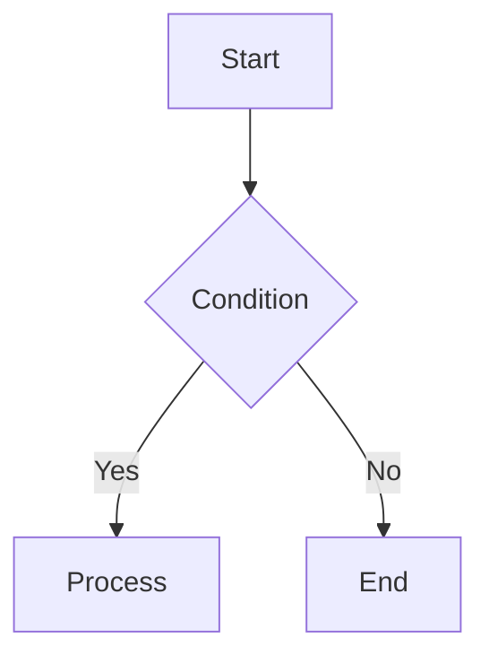

# **SOFTWARE REQUIREMENTS SPECIFICATION (SRS)**

## **DevMastery – Interactive Learning Platform**

**Version:** 2.0 (Merged)  
**Date:** February 14, 2026  
**Prepared by:** DevMastery Team  
**Status:** Final

---

## **TABLE OF CONTENTS**

1. [Introduction](#1-introduction)  
   1.1 [Purpose](#11-purpose)  
   1.2 [Document Conventions](#12-document-conventions)  
   1.3 [Intended Audience](#13-intended-audience)  
   1.4 [Project Scope](#14-project-scope)  
   1.5 [References](#15-references)

2. [Overall Description](#2-overall-description)  
   2.1 [Product Perspective](#21-product-perspective)  
   2.2 [Product Functions](#22-product-functions)  
   2.3 [User Classes and Characteristics](#23-user-classes-and-characteristics)  
   2.4 [Operating Environment](#24-operating-environment)  
   2.5 [Design and Implementation Constraints](#25-design-and-implementation-constraints)  
   2.6 [Assumptions and Dependencies](#26-assumptions-and-dependencies)

3. [System Features](#3-system-features)  
   3.1 [Content Management System](#31-content-management-system)  
    3.1.1 [Description](#311-description)  
    3.1.2 [Functional Requirements](#312-functional-requirements)  
    3.1.3 [AST-Based Markdown Pipeline](#313-ast-based-markdown-pipeline)  
    3.1.4 [Content Structure](#314-content-structure)  
   3.2 [Interactive Code Execution](#32-interactive-code-execution)  
    3.2.1 [Description](#321-description)  
    3.2.2 [Functional Requirements](#322-functional-requirements)  
    3.2.3 [Supported Languages](#323-supported-languages)  
    3.2.4 [Component Structure](#324-component-structure)  
    3.2.5 [Rate Limiting Specification](#325-rate-limiting-specification)  
   3.3 [Data Structure Visualizers](#33-data-structure-visualizers)  
    3.3.1 [Description](#331-description)  
    3.3.2 [Functional Requirements](#332-functional-requirements)  
    3.3.3 [Memory Visualizer](#333-memory-visualizer)  
    3.3.4 [Linked List Visualizer](#334-linked-list-visualizer)  
    3.3.5 [Tree Visualizer](#335-tree-visualizer)  
   3.4 [Diagram Generation](#34-diagram-generation)  
    3.4.1 [Mermaid Diagram Rendering](#341-mermaid-diagram-rendering)  
    3.4.2 [UML Class Diagrams](#342-uml-class-diagrams)  
    3.4.3 [System Architecture Diagrams](#343-system-architecture-diagrams)  
   3.5 [UI Components Library](#35-ui-components-library)  
    3.5.1 [Description](#351-description)  
    3.5.2 [Component Inventory](#352-component-inventory)  
    3.5.3 [Callout Component Specification](#353-callout-component-specification)  
    3.5.4 [Bento Card Variants](#354-bento-card-variants)  
   3.6 [Navigation System](#36-navigation-system)  
   3.7 [Theme System](#37-theme-system)  
    3.7.1 [Functional Requirements](#371-functional-requirements)  
    3.7.2 [Color Palette](#372-color-palette)  
    3.7.3 [Theme Persistence](#373-theme-persistence)  
   3.8 [Search Functionality](#38-search-functionality)  
   3.9 [Performance & Optimization](#39-performance--optimization)  
   3.10 [Accessibility](#310-accessibility)

4. [External Interface Requirements](#4-external-interface-requirements)  
   4.1 [User Interfaces](#41-user-interfaces)  
   4.2 [Hardware Interfaces](#42-hardware-interfaces)  
   4.3 [Software Interfaces](#43-software-interfaces)  
    4.3.1 [Piston API](#431-piston-api)  
    4.3.2 [Monaco Editor](#432-monaco-editor)  
    4.3.3 [Mermaid](#433-mermaid)  
   4.4 [Communication Interfaces](#44-communication-interfaces)

5. [System Architecture](#5-system-architecture)  
   5.1 [High-Level Architecture](#51-high-level-architecture)  
   5.2 [Component Architecture](#52-component-architecture)  
   5.3 [Data Flow Diagram](#53-data-flow-diagram)  
   5.4 [Build & Deployment Architecture](#54-build--deployment-architecture)

6. [Non-Functional Requirements](#6-non-functional-requirements)  
   6.1 [Performance Requirements](#61-performance-requirements)  
   6.2 [Usability Requirements](#62-usability-requirements)  
   6.3 [Reliability Requirements](#63-reliability-requirements)  
   6.4 [Security Requirements](#64-security-requirements)  
   6.5 [Accessibility Requirements](#65-accessibility-requirements)  
   6.6 [Maintainability Requirements](#66-maintainability-requirements)  
   6.7 [Portability Requirements](#67-portability-requirements)

7. [Technical Specifications](#7-technical-specifications)  
   7.1 [Technology Stack](#71-technology-stack)  
   7.2 [File Structure](#72-file-structure)  
   7.3 [Database Schema](#73-database-schema)  
   7.4 [API Specifications](#74-api-specifications)  
   7.5 [Third-Party Dependencies](#75-third-party-dependencies)

8. [Data Requirements](#8-data-requirements)  
   8.1 [Content Data Model](#81-content-data-model)  
   8.2 [Content Statistics](#82-content-statistics)  
   8.3 [User Data (Client-Side)](#83-user-data-client-side)

9. [Security Requirements](#9-security-requirements)  
   9.1 [Authentication & Authorization](#91-authentication--authorization)  
   9.2 [Data Protection](#92-data-protection)  
   9.3 [Input Validation](#93-input-validation)  
   9.4 [Code Execution Security](#94-code-execution-security)  
   9.5 [Dependency Security](#95-dependency-security)  
   9.6 [Content Security Policy](#96-content-security-policy)

10. [Quality Attributes](#10-quality-attributes)  
    10.1 [Scalability](#101-scalability)  
    10.2 [Availability](#102-availability)  
    10.3 [Testability](#103-testability)  
    10.4 [Usability](#104-usability)  
    10.5 [Internationalization](#105-internationalization)

11. [Project Timeline](#11-project-timeline)  
    11.1 [Development Phases](#111-development-phases)  
    11.2 [Milestones](#112-milestones)  
    11.3 [Resource Allocation](#113-resource-allocation)

12. [Appendices](#12-appendices)  
    12.1 [Glossary](#121-glossary)  
    12.2 [Acronyms](#122-acronyms)  
    12.3 [References](#123-references)  
    12.4 [Document Revision History](#124-document-revision-history)

**Approval Signatures**  
**End of Document**

---

## **1. INTRODUCTION**

### **1.1 Purpose**

This Software Requirements Specification (SRS) document provides a complete and detailed description of the DevMastery platform – an interactive educational web application designed to teach Object-Oriented Programming (OOP), Data Structures & Algorithms (DSA), Spring Boot, and System Design through interactive visualizations and hands-on code execution. It combines the formal structure of a traditional SRS with the technical depth required for implementation, including an AST-based Markdown pipeline, a comprehensive component library, and a robust design system.

### **1.2 Document Conventions**

- **SHALL/MUST**: Mandatory requirement
- **SHOULD**: Recommended requirement
- **MAY**: Optional requirement
- Requirement IDs follow the pattern `FR-XXX-NNN` (Functional Requirement, Section, Number)

### **1.3 Intended Audience**

- Development Team
- Project Managers
- Quality Assurance Engineers
- System Architects
- Stakeholders
- Content Creators

### **1.4 Project Scope**

**In Scope:**

- 100+ interactive tutorial pages covering OOP, DSA, Spring Boot, System Design
- Live code execution in 10+ languages (Python, Java, C++, etc.) using Monaco Editor and Piston API
- Visual data structure representations (arrays, linked lists, trees, stacks, queues)
- UML class diagram generator
- System architecture diagram builder
- Mermaid diagram rendering (flowcharts, sequence diagrams, etc.)
- Custom directives for callouts (`:::tip`, `:::warning`) and diagram blocks
- Dark/light theme switching
- Mobile-responsive design
- SEO optimization
- PWA capabilities

**Out of Scope (v1.0):**

- User authentication/authorization
- User-generated content
- Database backend
- Payment processing
- Real-time collaboration
- Video streaming
- Discussion forums

### **1.5 References**

- Angular Documentation: https://angular.io
- AnalogJS Documentation: https://analogjs.org
- Unified / Remark: https://unifiedjs.com
- Piston API: https://github.com/engineer-man/piston
- Mermaid: https://mermaid.js.org
- Monaco Editor: https://microsoft.github.io/monaco-editor
- Tailwind CSS: https://tailwindcss.com
- Algolia DocSearch: https://docsearch.algolia.com

---

## **2. OVERALL DESCRIPTION**

### **2.1 Product Perspective**

DevMastery is a standalone web application built with Angular and AnalogJS, following a **hybrid Docs‑as‑Code / Docs‑as‑App** model. Content is authored in Markdown, version-controlled via Git, and transformed during build into a statically generated Angular SPA. The platform integrates with external services:

- **Piston API** for sandboxed code execution.
- **Algolia DocSearch** (optional) for search.
- **CDN** (Vercel/Netlify) for global asset delivery.

### **2.2 Product Functions**

1. **Content Authoring** – Authors write Markdown with frontmatter and custom directives (e.g., `:::tip`, ` ```mermaid `, `<app-code-playground>`).
2. **AST-Based Content Processing** – During build, Markdown is parsed into an Abstract Syntax Tree (AST) using Unified/Remark, transformed into Angular components, and rendered as HTML.
3. **Navigation** – Collapsible sidebar generated from folder structure, table of contents, breadcrumbs.
4. **Interactive Visualizations** – Mermaid diagrams, data structure visualizers, UML class cards, system architecture diagrams.
5. **Live Code Execution** – Monaco editor with Piston API integration, rate-limited, with output console.
6. **Search** – Full-text search across all content (Algolia or client-side).
7. **Responsive Layout** – Adapts to desktop, tablet, and mobile screens.
8. **Theme Switching** – Light/dark mode with persistent preference.

### **2.3 User Classes and Characteristics**

| User Class      | Technical Level          | Primary Goals                       | Frequency |
| --------------- | ------------------------ | ----------------------------------- | --------- |
| **Students**    | Beginner to Intermediate | Learn concepts through tutorials    | Daily     |
| **Developers**  | Intermediate to Advanced | Quick reference and advanced topics | Weekly    |
| **Educators**   | Intermediate             | Use visualizations for teaching     | Weekly    |
| **Job Seekers** | Intermediate             | Prepare for technical interviews    | Daily     |

### **2.4 Operating Environment**

- **Client:** Modern browsers (Chrome 90+, Firefox 88+, Safari 14+, Edge 90+), JavaScript enabled, 1 Mbps+ connection.
- **Server:** Static hosting (Vercel/Netlify), CDN, no application server.
- **Build:** Node.js 18+, npm, Angular CLI.

### **2.5 Design and Implementation Constraints**

- **Framework:** MUST use Angular 17+ and AnalogJS.
- **Content Format:** All content MUST be authored in Markdown; no hard-coded HTML.
- **Markdown Processing:** MUST use Unified/Remark AST pipeline; regex parsing is prohibited.
- **Lazy Loading:** Heavy libraries (Monaco, Mermaid) MUST be lazy-loaded.
- **Code Execution:** MUST use Piston API with client-side rate limiting.
- **Design System:** MUST adhere to the Deep Learning theme (colors, typography) defined in Section 3.7.

### **2.6 Assumptions and Dependencies**

- **Assumptions:**
  - Authors have Git knowledge and access to the content repository.
  - Piston API remains free and publicly accessible.
  - Users have modern browsers.
- **Dependencies:**
  - Node.js, npm for build.
  - External services: Piston API, Algolia (optional), CDN.
  - Third-party libraries: Angular, Analog, Tailwind, Unified, Mermaid, Monaco.

---

## **3. SYSTEM FEATURES**

### **3.1 Content Management System**

#### **3.1.1 Description**

A markdown-based content system that converts `.md` files into navigable HTML pages with frontmatter metadata, using an **AST-based pipeline** for secure and extensible transformation.

#### **3.1.2 Functional Requirements**

| ID        | Requirement                                                                                                         | Priority |
| --------- | ------------------------------------------------------------------------------------------------------------------- | -------- |
| FR-CM-001 | System SHALL parse markdown files from `/content` directory using Unified/Remark.                                   | MUST     |
| FR-CM-002 | System SHALL support YAML frontmatter (title, description, order, date, author, tags, category, featured, draft).   | MUST     |
| FR-CM-003 | System SHALL generate navigation tree from folder structure, respecting `order` in frontmatter.                     | MUST     |
| FR-CM-004 | System SHALL support custom directives: `:::tip[title]`, `:::note[title]`, `:::warning[title]`, `:::danger[title]`. | MUST     |
| FR-CM-005 | System SHALL transform these directives into `<app-callout>` components via AST.                                    | MUST     |
| FR-CM-006 | System SHALL recognize code blocks with language `mermaid` and replace them with `<app-mermaid-viz>` components.    | MUST     |
| FR-CM-007 | System SHALL support embedding of custom Angular components (e.g., `<app-code-playground>`) in markdown.            | MUST     |
| FR-CM-008 | System SHALL support LaTeX math using `$...$` and `$$...$$` via remark-math and rehype-katex.                       | MUST     |
| FR-CM-009 | System SHALL preserve unknown HTML tags (e.g., `<app-memory-viz>`) in the output for Angular to process.            | MUST     |
| FR-CM-010 | System SHALL generate breadcrumbs from URL path.                                                                    | SHOULD   |
| FR-CM-011 | System SHALL generate anchor links for all headings.                                                                | SHOULD   |
| FR-CM-012 | System MAY support client-side search indexing.                                                                     | MAY      |

#### **3.1.3 AST-Based Markdown Pipeline**

The build pipeline uses Unified (Remark + Rehype) to parse Markdown into an AST, apply custom transformers, and output HTML with Angular component tags.

**Vite Configuration (vite.config.ts) excerpt:**

```typescript
import { defineConfig } from "vite";
import analog from "@analogjs/platform";
import { unified } from "unified";
import remarkParse from "remark-parse";
import remarkDirective from "remark-directive";
import remarkMath from "remark-math";
import rehypeKatex from "rehype-katex";
import remarkRehype from "remark-rehype";
import rehypeStringify from "rehype-stringify";
import { visit } from "unist-util-visit";

// Custom transformer for directives
function angularDirectives() {
  return (tree) => {
    visit(tree, "containerDirective", (node) => {
      if (["tip", "note", "warning", "danger"].includes(node.name)) {
        node.data = node.data || {};
        node.data.hName = "app-callout";
        node.data.hProperties = {
          type: node.name,
          title: node.attributes?.title || node.name.toUpperCase(),
        };
      }
    });
  };
}

// Mermaid transformer
function mermaidTransformer() {
  return (tree) => {
    visit(tree, "code", (node) => {
      if (node.lang === "mermaid") {
        node.type = "html";
        node.value = `<app-mermaid-viz code="${encodeURIComponent(node.value)}"></app-mermaid-viz>`;
      }
    });
  };
}

export default defineConfig({
  plugins: [
    analog({
      content: {
        renderer: (code) => {
          return unified().use(remarkParse).use(remarkDirective).use(angularDirectives).use(mermaidTransformer).use(remarkMath).use(remarkRehype, { allowDangerousHtml: true }).use(rehypeKatex).use(rehypeStringify, { allowDangerousHtml: true }).processSync(code).toString();
        },
        highlighter: "shiki",
      },
    }),
  ],
});
```

#### **3.1.4 Content Structure**

```
content/
├── index.md
├── 1-oop/
│   ├── 1-fundamentals/
│   │   ├── what-is-oop.md
│   │   └── classes-objects.md
│   └── 2-design-patterns/
│       └── singleton.md
├── 2-dsa/
│   ├── 1-arrays/
│   ├── 2-linked-lists/
│   └── ...
├── 3-spring-boot/
└── 4-system-design/
```

---

### **3.2 Interactive Code Execution**

#### **3.2.1 Description**

Browser-based code editor with live execution capabilities using Monaco Editor (lazy-loaded) and Piston API.

#### **3.2.2 Functional Requirements**

| ID        | Requirement                                                                                        | Priority |
| --------- | -------------------------------------------------------------------------------------------------- | -------- |
| FR-CE-001 | System SHALL provide Monaco Editor with syntax highlighting for 10+ languages.                     | MUST     |
| FR-CE-002 | System SHALL support languages: Python, JavaScript, Java, C++, C, TypeScript, Rust, Go, Ruby, PHP. | MUST     |
| FR-CE-003 | System SHALL execute code via Piston API.                                                          | MUST     |
| FR-CE-004 | System SHALL display stdout, stderr, and exit code in a console panel.                             | MUST     |
| FR-CE-005 | System SHALL implement rate limiting: 5 executions per minute per user.                            | MUST     |
| FR-CE-006 | System SHALL display remaining execution attempts and reset timer.                                 | MUST     |
| FR-CE-007 | System SHALL provide "Run Code" and "Reset Code" buttons.                                          | MUST     |
| FR-CE-008 | System SHALL show loading state during execution.                                                  | MUST     |
| FR-CE-009 | System SHALL lazy-load Monaco Editor on first use.                                                 | MUST     |
| FR-CE-010 | System SHOULD cache editor instance after load.                                                    | SHOULD   |
| FR-CE-011 | System MAY support stdin input.                                                                    | MAY      |
| FR-CE-012 | System MAY save code to localStorage.                                                              | MAY      |

#### **3.2.3 Supported Languages**

| Language   | Version | File Extension |
| ---------- | ------- | -------------- |
| Python     | 3.10.0  | .py            |
| JavaScript | 18.15.0 | .js            |
| Java       | 15.0.2  | .java          |
| C++        | 10.2.0  | .cpp           |
| C          | 10.2.0  | .c             |
| TypeScript | 5.0.3   | .ts            |
| Rust       | 1.68.2  | .rs            |
| Go         | 1.16.2  | .go            |
| Ruby       | 3.0.1   | .rb            |
| PHP        | 8.2.3   | .php           |

#### **3.2.4 Component Structure**

```html
<app-code-playground language="python" title="Binary Search" fileName="binary_search.py" code="def binary_search(arr, target): ..." description="O(log n) algorithm"> </app-code-playground>
```

#### **3.2.5 Rate Limiting Specification**

- **Strategy:** Sliding window (store timestamps in memory).
- **Max requests:** 5 per 60 seconds.
- **UI:** Display countdown when limit reached.

---

### **3.3 Data Structure Visualizers**

#### **3.3.1 Description**

Interactive components that visually demonstrate data structures with animations and step-by-step operations.

#### **3.3.2 Functional Requirements**

| ID         | Requirement                                              | Priority |
| ---------- | -------------------------------------------------------- | -------- |
| FR-DSV-001 | System SHALL provide memory/array visualizer.            | MUST     |
| FR-DSV-002 | System SHALL provide linked list visualizer.             | MUST     |
| FR-DSV-003 | System SHALL provide binary tree visualizer.             | MUST     |
| FR-DSV-004 | System SHALL provide stack visualizer.                   | MUST     |
| FR-DSV-005 | System SHALL provide queue visualizer.                   | MUST     |
| FR-DSV-006 | System SHALL support element highlighting.               | MUST     |
| FR-DSV-007 | System SHALL support pointer visualization.              | MUST     |
| FR-DSV-008 | System SHALL display indices and memory addresses (hex). | SHOULD   |
| FR-DSV-009 | System SHALL provide step-by-step animations.            | SHOULD   |
| FR-DSV-010 | System MAY support graph visualizer.                     | MAY      |

#### **3.3.3 Memory Visualizer**

**Features:**

- Display array elements as boxes.
- Show indices above cells, memory addresses below (hex).
- Support up to 2 pointers with custom colors.
- Highlight specific indices.
- Show legend.

**Usage:**

```html
<app-memory-viz [data]="[1,2,3,4,5]" [highlightIndices]="[2]" [pointers]="[{ name: 'left', index: 0, color: '#3b82f6' }]" baseAddress="0x1000"> </app-memory-viz>
```

#### **3.3.4 Linked List Visualizer**

- Display nodes as boxes with data and pointer sections.
- Show arrows connecting nodes, NULL terminator, HEAD pointer.
- Support node highlighting.

#### **3.3.5 Tree Visualizer**

- Render binary tree hierarchically.
- Calculate node positions automatically.
- Draw edges, show node values.
- Highlight nodes.

---

### **3.4 Diagram Generation**

#### **3.4.1 Mermaid Diagram Rendering**

| ID        | Requirement                                   | Priority |
| --------- | --------------------------------------------- | -------- |
| FR-MD-001 | System SHALL render Mermaid flowcharts.       | MUST     |
| FR-MD-002 | System SHALL render sequence diagrams.        | MUST     |
| FR-MD-003 | System SHALL render class diagrams.           | MUST     |
| FR-MD-004 | System SHALL render state diagrams.           | MUST     |
| FR-MD-005 | System SHALL support dark/light themes.       | MUST     |
| FR-MD-006 | System SHALL lazy-load Mermaid on first use.  | MUST     |
| FR-MD-007 | System SHALL show loading indicator.          | SHOULD   |
| FR-MD-008 | System SHALL handle syntax errors gracefully. | MUST     |

**Example markdown:**

````markdown

````

**Component implementation (lazy-loaded):**

```typescript
async function renderMermaid() {
  const mermaid = await import("mermaid");
  mermaid.initialize({ theme: "dark", startOnLoad: false });
  const { svg } = await mermaid.render("id", diagramCode);
  container.innerHTML = svg;
}
```

#### **3.4.2 UML Class Diagrams**

- Display class name, fields, methods with visibility symbols (`+`, `-`, `#`, `~`).
- Support stereotypes (interface, abstract).

**Component:**

```html
<app-uml-card name="BankAccount" [fields]="['- accountNumber: string', '+ balance: double']" [methods]="['+ deposit(amount: double): void']" stereotype="class"> </app-uml-card>
```

#### **3.4.3 System Architecture Diagrams**

- 10+ node types (server, database, cache, load balancer, queue, CDN, API, client, storage, firewall).
- Support status indicators (active/inactive/error).
- Animated data flow arrows.

**Component:**

```html
<app-architecture-map>
  <app-system-node type="lb" label="Load Balancer" status="active"></app-system-node>
  <app-system-node type="db" label="Database" status="active"></app-system-node>
  <app-flow-arrow from="lb" to="db" direction="right" animated="true"></app-flow-arrow>
</app-architecture-map>
```

---

### **3.5 UI Components Library**

#### **3.5.1 Description**

Reusable, styled components for consistent user experience across all pages, built with Tailwind CSS and Angular.

#### **3.5.2 Component Inventory**

| Component           | Purpose                         | Priority | Properties                              |
| ------------------- | ------------------------------- | -------- | --------------------------------------- |
| **Callout**         | Highlight important information | MUST     | type, title, content (ng-content)       |
| **CodeBlock**       | Display code with copy button   | MUST     | code, language, fileName                |
| **BentoGrid**       | Responsive card grid layout     | MUST     | columns, gap                            |
| **BentoCard**       | Feature showcase cards          | MUST     | title, description, icon, href, variant |
| **TabGroup**        | Organize content in tabs        | SHOULD   | tabs                                    |
| **Tab**             | Individual tab content          | SHOULD   | label, active                           |
| **Badge**           | Small status indicators         | SHOULD   | text, variant                           |
| **Alert**           | System notifications            | SHOULD   | message, type                           |
| **Button**          | Call-to-action buttons          | MUST     | text, variant, href, disabled           |
| **Breadcrumbs**     | Navigation path                 | MUST     | path array                              |
| **TableOfContents** | Page headings                   | MUST     | headings (auto-generated)               |

#### **3.5.3 Callout Component Specification**

**Types:** tip, note, warning, danger, info, success  
**Example usage in markdown:**

```markdown
:::tip[Performance Hint]
Use memoization to optimize recursive functions.
:::
```

**Component template:**

```html
<div [class]="'border-l-4 p-4 mb-4 rounded-r ' + typeClasses">
  <h4 class="font-bold uppercase text-xs mb-1">{{ title || type }}</h4>
  <ng-content></ng-content>
</div>
```

#### **3.5.4 Bento Card Variants**

| Variant     | Background     | Border    | Use Case       |
| ----------- | -------------- | --------- | -------------- |
| `default`   | White/Gray-800 | Gray-200  | Standard cards |
| `feature`   | Brand gradient | Brand-200 | Hero features  |
| `highlight` | Brand-500      | Brand-600 | Call-to-action |
| `minimal`   | Transparent    | Gray-200  | Subtle cards   |

---

### **3.6 Navigation System**

| ID         | Requirement                                                                   | Priority |
| ---------- | ----------------------------------------------------------------------------- | -------- |
| FR-NAV-001 | System SHALL provide top navigation bar with links to main sections.          | MUST     |
| FR-NAV-002 | System SHALL generate left sidebar from content structure.                    | MUST     |
| FR-NAV-003 | System SHALL highlight active page in sidebar.                                | MUST     |
| FR-NAV-004 | System SHALL provide breadcrumbs (Home > Section > Page).                     | SHOULD   |
| FR-NAV-005 | System SHALL support hamburger menu on mobile.                                | MUST     |
| FR-NAV-006 | System SHALL provide sticky "On This Page" table of contents (right sidebar). | SHOULD   |
| FR-NAV-007 | System SHALL support keyboard navigation (tab, enter).                        | SHOULD   |

---

### **3.7 Theme System**

#### **3.7.1 Functional Requirements**

| ID         | Requirement                                                  | Priority |
| ---------- | ------------------------------------------------------------ | -------- |
| FR-THM-001 | System SHALL support light and dark themes.                  | MUST     |
| FR-THM-002 | System SHALL persist theme preference in localStorage.       | MUST     |
| FR-THM-003 | System SHALL provide theme toggle button.                    | MUST     |
| FR-THM-004 | System SHALL apply theme to all components.                  | MUST     |
| FR-THM-005 | System SHALL respect system theme preference on first visit. | SHOULD   |
| FR-THM-006 | System SHALL transition smoothly between themes (no flash).  | SHOULD   |

#### **3.7.2 Color Palette (Deep Learning Theme)**

**Light Theme:**

```css
--background: #ffffff;
--foreground: #1f2937;
--primary: #6366f1; /* Indigo-500 */
--primary-dark: #4338ca; /* Indigo-700 */
--secondary: #f3f4f6;
--accent: #8b5cf6;
--muted: #9ca3af;
--border: #e5e7eb;
--logic-address: #3b82f6; /* Blue */
--logic-value: #10b981; /* Emerald */
--logic-pointer: #f43f5e; /* Rose */
--signal-note: #3b82f6;
--signal-tip: #22c55e;
--signal-warn: #f59e0b;
--signal-danger: #ef4444;
```

**Dark Theme:**

```css
--background: #111827;
--foreground: #f3f4f6;
--primary: #818cf8; /* Indigo-400 */
--primary-dark: #6366f1;
--secondary: #1f2937;
--accent: #a78bfa;
--muted: #6b7280;
--border: #374151;
--logic-address: #60a5fa;
--logic-value: #34d399;
--logic-pointer: #fb7185;
```

#### **3.7.3 Theme Persistence**

```typescript
if (localStorage.theme === "dark" || (!("theme" in localStorage) && window.matchMedia("(prefers-color-scheme: dark)").matches)) {
  document.documentElement.classList.add("dark");
}
```

---

### **3.8 Search Functionality**

(Optional) Integrate Algolia DocSearch or client-side search (Fuse.js).

- Search input in header.
- Instant results, keyboard navigation.
- Index page titles, headings, content.

---

### **3.9 Performance & Optimization**

- Lazy-load Monaco and Mermaid.
- Pre-render all pages at build time (SSG).
- Optimize images, use responsive sizes.
- Bundle splitting for routes.
- Service worker for offline caching.

---

### **3.10 Accessibility**

- WCAG 2.1 AA compliance.
- Semantic HTML, ARIA labels.
- Keyboard navigation.
- Sufficient color contrast.
- Focus indicators.

---

## **4. EXTERNAL INTERFACE REQUIREMENTS**

### **4.1 User Interfaces**

Refer to Section 3 for component specifications and layout descriptions. Responsive breakpoints: 320px (mobile), 640px (tablet), 1024px (desktop).

### **4.2 Hardware Interfaces**

None.

### **4.3 Software Interfaces**

#### **4.3.1 Piston API**

- Base URL: `https://emkc.org/api/v2/piston`
- Endpoint: `POST /execute`
- Request body includes language, version, files, stdin.
- Response includes stdout, stderr, code, output.
- Rate limiting handled client-side.

#### **4.3.2 Monaco Editor**

- Lazy-loaded via dynamic import.
- Initialized with language, theme, and value.
- Provides `getValue()` and `setValue()` methods.

#### **4.3.3 Mermaid**

- Lazy-loaded via dynamic import.
- Initialized with theme matching the site.
- Render diagram from code string.

### **4.4 Communication Interfaces**

- HTTPS only.
- Browser localStorage for preferences.
- No WebSockets.

---

## **5. SYSTEM ARCHITECTURE**

### **5.1 High-Level Architecture**

```
┌─────────────────────────────────────────────────────┐
│                    User Browser                      │
│  ┌───────────────────────────────────────────────┐  │
│  │          Angular SPA (DevMastery)              │  │
│  │  ┌────────────┐  ┌────────────┐  ┌────────┐  │  │
│  │  │   Routing  │  │  Content   │  │  Theme  │  │  │
│  │  │  (Analog)  │  │  Renderer  │  │  Service│  │  │
│  │  └────────────┘  └────────────┘  └────────┘  │  │
│  │  ┌────────────┐  ┌────────────┐  ┌────────┐  │  │
│  │  │  Monaco    │  │  Mermaid   │  │  DSA    │  │  │
│  │  │  (lazy)    │  │  (lazy)    │  │  Viz    │  │  │
│  │  └────────────┘  └────────────┘  └────────┘  │  │
│  │  ┌─────────────────────────────────────────┐  │  │
│  │  │      Services (CodeExec, RateLimit)      │  │  │
│  │  └─────────────────────────────────────────┘  │  │
│  └───────────────────────────────────────────────┘  │
│         │               │               │            │
│    ┌────▼────┐    ┌──────▼──────┐   ┌──▼───┐        │
│    │localStorage│    │Service Worker│   │CDN   │        │
│    └──────────┘    └─────────────┘   └──────┘        │
└─────────────────────────┬──────────────────────────────┘
                          │
               ┌──────────┼──────────┐
               │          │          │
          ┌────▼────┐ ┌───▼────┐ ┌───▼────┐
          │ Piston  │ │Algolia │ │  CDN   │
          │  API    │ │(opt)   │ │ Assets │
          └─────────┘ └────────┘ └────────┘
```

### **5.2 Component Architecture**

(Same as SRS Section 5.2, but with detailed component tree.)

### **5.3 Data Flow Diagram**

(Same as SRS Section 5.3, but with AST pipeline step added.)

### **5.4 Build & Deployment Architecture**

(Same as SRS Section 5.4.)

---

## **6. NON-FUNCTIONAL REQUIREMENTS**

### **6.1 Performance Requirements**

| Metric                       | Target            |
| ---------------------------- | ----------------- |
| First Contentful Paint       | < 1.5s            |
| Largest Contentful Paint     | < 2.5s            |
| Time to Interactive          | < 3.5s            |
| Total Blocking Time          | < 300ms           |
| Lighthouse Performance Score | ≥ 90              |
| Initial Bundle Size          | < 300KB (gzipped) |
| Monaco load time             | < 3s (first use)  |
| Mermaid render time          | < 1s              |

### **6.2 Usability Requirements**

- Navigation within 3 clicks.
- Mobile usability: 100% features work.
- Error messages clear and actionable.
- Task success rate ≥ 95%.

### **6.3 Reliability Requirements**

- Uptime: 99.9% (CDN dependent).
- Error rate < 0.1%.
- Graceful degradation when Piston API unavailable.

### **6.4 Security Requirements**

- Content Security Policy headers.
- Input validation (code, search queries).
- Rate limiting (5 executions/min).
- No PII stored.
- HTTPS enforced.

### **6.5 Accessibility Requirements**

- WCAG 2.1 AA.
- Screen reader compatible.
- Keyboard navigable.
- Color contrast ≥ 4.5:1.
- Alt text on all images.

### **6.6 Maintainability Requirements**

- Unit test coverage ≥ 80% for services.
- JSDoc for all public methods.
- ESLint passed with 0 errors.
- TypeScript strict mode.

### **6.7 Portability Requirements**

- Browsers: Chrome 90+, Firefox 88+, Safari 14+, Edge 90+.
- Devices: Desktop, tablet, mobile.
- Screen sizes: 320px to 2560px.

---

## **7. TECHNICAL SPECIFICATIONS**

### **7.1 Technology Stack**

| Layer                   | Technology                  |
| ----------------------- | --------------------------- |
| **Framework**           | Angular 17+                 |
| **Meta-framework**      | AnalogJS                    |
| **Markdown Processing** | Unified (Remark, Rehype)    |
| **Styling**             | Tailwind CSS 3.4+           |
| **Code Editor**         | Monaco Editor (lazy)        |
| **Diagrams**            | Mermaid (lazy)              |
| **Code Execution**      | Piston API                  |
| **Math**                | KaTeX                       |
| **Search**              | Algolia DocSearch / Fuse.js |
| **Hosting**             | Vercel / Netlify            |

### **7.2 File Structure**

(As provided in SRS Section 7.2.)

### **7.3 Database Schema**

None.

### **7.4 API Specifications**

**CodeExecutionService** (methods as before)  
**RateLimiterService**  
**SEOService**  
**AnalyticsService**

### **7.5 Third-Party Dependencies**

(As in SRS Section 7.5, with Unified packages added: `unified`, `remark-parse`, `remark-directive`, `remark-math`, `rehype-katex`, `unist-util-visit`.)

---

## **8. DATA REQUIREMENTS**

### **8.1 Content Data Model**

(As in SRS Section 8.1.)

### **8.2 Content Statistics**

Target: 100 pages, 200,000 words.

### **8.3 User Data (Client-Side)**

Stored in localStorage: theme preference, code execution history, bookmarks (optional).

---

## **9. SECURITY REQUIREMENTS**

### **9.1 Authentication & Authorization**

None.

### **9.2 Data Protection**

HTTPS, no PII.

### **9.3 Input Validation**

- Code: sent to Piston API.
- Search: sanitized (remove HTML tags).
- Theme: validated against enum.

### **9.4 Code Execution Security**

- Sandboxed via Piston.
- Rate limiting.
- Timeout after 10 seconds.
- Output size limit.

### **9.5 Dependency Security**

Weekly `npm audit`, Dependabot.

### **9.6 Content Security Policy**

```http
Content-Security-Policy: default-src 'self'; script-src 'self' 'unsafe-inline' https://www.googletagmanager.com; style-src 'self' 'unsafe-inline'; img-src 'self' data: https:; connect-src 'self' https://emkc.org; ...
```

---

## **10. QUALITY ATTRIBUTES**

### **10.1 Scalability**

Static files served via CDN, auto-scaling.

### **10.2 Availability**

99.9% target, offline fallback via service worker.

### **10.3 Testability**

Unit tests with Vitest, component tests with Angular Testing Library.

### **10.4 Usability**

SUS target ≥ 70, user testing quarterly.

### **10.5 Internationalization**

English only v1.0; i18n-ready architecture.

---

## **11. PROJECT TIMELINE**

### **11.1 Development Phases**

| Phase                           | Duration | Tasks                                                 |
| ------------------------------- | -------- | ----------------------------------------------------- |
| Phase 1: Setup                  | Week 1-2 | Project initialization, tooling, folder structure     |
| Phase 2: UI Components          | Week 3-4 | Build reusable UI library (Callout, CodeBlock, etc.)  |
| Phase 3: DSA Visualizers        | Week 5   | Memory, linked list, tree, stack, queue visualizers   |
| Phase 4: Interactive            | Week 6-7 | Monaco, Mermaid, code execution, UML, system diagrams |
| Phase 5: Content & Optimization | Week 8-9 | Write 100+ pages, SEO, performance optimization       |
| Phase 6: Testing & Deployment   | Week 10  | QA, performance testing, deployment                   |

### **11.2 Milestones**

(As in SRS Section 11.2.)

### **11.3 Resource Allocation**

- Full-Stack Developer (100%)
- Content Writer (50%)
- UI/UX Designer (20%)
- QA Engineer (30%)

---

## **12. APPENDICES**

### **12.1 Glossary**

- **AST:** Abstract Syntax Tree
- **Callout:** Styled content box for tips/warnings
- **Monaco:** VS Code's editor component
- **Piston:** Code execution API
- **Unified:** Ecosystem for processing content with ASTs

### **12.2 Acronyms**

(As in SRS Section 12.2.)

### **12.3 References**

(As in SRS Section 12.3, plus Unified documentation.)

### **12.4 Document Revision History**

| Version | Date       | Author          | Changes                         |
| ------- | ---------- | --------------- | ------------------------------- |
| 0.1     | 2026-01-15 | DevMastery Team | Initial draft                   |
| 0.5     | 2026-02-01 | DevMastery Team | Added technical specs           |
| 1.0     | 2026-02-14 | DevMastery Team | Final version                   |
| 2.0     | 2026-02-14 | DevMastery Team | Merged with technical blueprint |

---

## **APPROVAL SIGNATURES**

| Role                | Name                 | Signature            | Date         |
| ------------------- | -------------------- | -------------------- | ------------ |
| **Project Manager** | ********\_\_******** | ********\_\_******** | **\_\_\_\_** |
| **Lead Developer**  | ********\_\_******** | ********\_\_******** | **\_\_\_\_** |
| **Tech Lead**       | ********\_\_******** | ********\_\_******** | **\_\_\_\_** |
| **QA Manager**      | ********\_\_******** | ********\_\_******** | **\_\_\_\_** |
| **Stakeholder**     | ********\_\_******** | ********\_\_******** | **\_\_\_\_** |

---

**END OF DOCUMENT**

**Document ID:** SRS-DEVMASTERY-002  
**Status:** Final  
**Classification:** Internal Use  
**Total Pages:** 48
