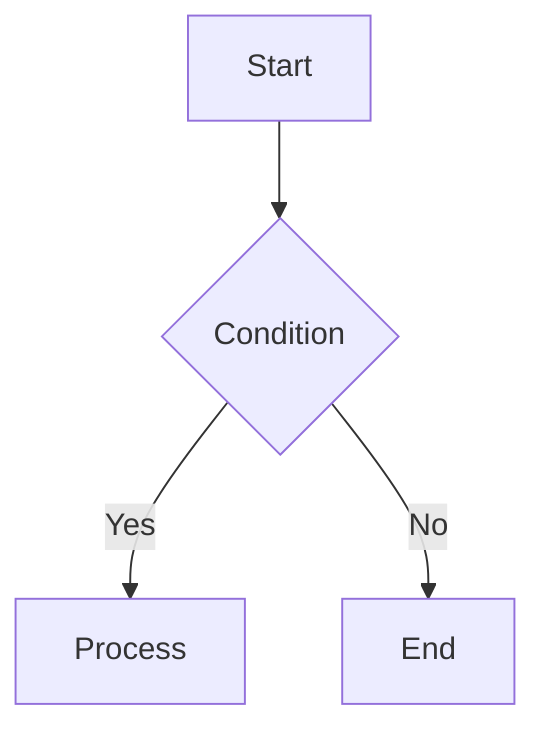
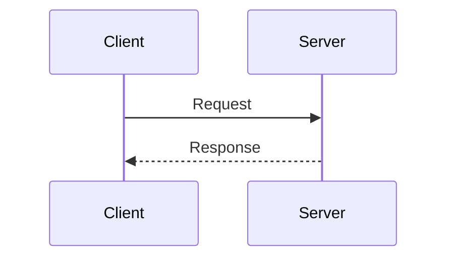
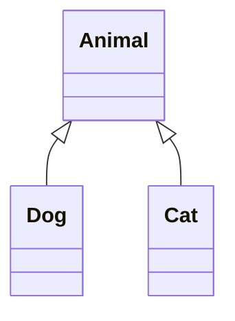
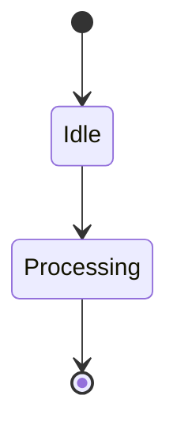

# 📋 **SOFTWARE REQUIREMENTS SPECIFICATION (SRS)**

## **DevMastery - Interactive Learning Platform**

**Version:** 1.0  
**Date:** February 14, 2026  
**Prepared by:** DevMastery Team  
**Status:** Final

---

## **TABLE OF CONTENTS**

1. [Introduction](#1-introduction)
2. [Overall Description](#2-overall-description)
3. [System Features](#3-system-features)
4. [External Interface Requirements](#4-external-interface-requirements)
5. [System Architecture](#5-system-architecture)
6. [Non-Functional Requirements](#6-non-functional-requirements)
7. [Technical Specifications](#7-technical-specifications)
8. [Data Requirements](#8-data-requirements)
9. [Security Requirements](#9-security-requirements)
10. [Quality Attributes](#10-quality-attributes)
11. [Project Timeline](#11-project-timeline)
12. [Appendices](#12-appendices)

---

## **1. INTRODUCTION**

### **1.1 Purpose**

This Software Requirements Specification (SRS) document provides a comprehensive description of the DevMastery platform - an interactive educational web application designed to teach Object-Oriented Programming (OOP), Data Structures & Algorithms (DSA), Spring Boot framework, and System Design concepts through interactive visualizations and hands-on code execution.

**Intended Audience:**

- Development Team
- Project Managers
- Quality Assurance Engineers
- System Architects
- Stakeholders
- Content Creators

### **1.2 Document Conventions**

- **SHALL/MUST**: Mandatory requirement
- **SHOULD**: Recommended requirement
- **MAY**: Optional requirement
- **Component**: Reusable UI element
- **Module**: Logical grouping of functionality
- **Route**: URL path in the application

### **1.3 Intended Audience and Reading Suggestions**

| Audience             | Relevant Sections    |
| -------------------- | -------------------- |
| **Developers**       | Sections 3, 5, 7, 8  |
| **Designers**        | Sections 3, 4, 6.2   |
| **QA Engineers**     | Sections 3, 6, 9, 10 |
| **Project Managers** | Sections 2, 6, 11    |
| **Content Writers**  | Sections 3.2, 8.2    |

### **1.4 Project Scope**

**DevMastery** is a static, pre-rendered educational platform that provides:

**In Scope:**

- 100+ interactive tutorial pages
- Live code execution (Python, JavaScript, Java, C++, etc.)
- Visual data structure representations
- UML diagram generators
- System architecture visualizations
- Mermaid diagram rendering
- Dark mode support
- Mobile-responsive design
- SEO optimization
- PWA capabilities

**Out of Scope:**

- User authentication/authorization
- User-generated content
- Database backend
- Payment processing
- Real-time collaboration
- Video streaming
- Discussion forums

### **1.5 References**

- Angular 17 Documentation: https://angular.io
- AnalogJS Documentation: https://analogjs.org
- Tailwind CSS Documentation: https://tailwindcss.com
- Piston API Documentation: https://github.com/engineer-man/piston
- Mermaid Documentation: https://mermaid.js.org
- Monaco Editor Documentation: https://microsoft.github.io/monaco-editor

---

## **2. OVERALL DESCRIPTION**

### **2.1 Product Perspective**

DevMastery is a **standalone web application** that operates as a static site with dynamic client-side interactions. It does not require a backend server except for third-party APIs.

**System Context:**

```
┌─────────────────────────────────────────────────────┐
│                  DevMastery Platform                 │
│  ┌────────────┐  ┌────────────┐  ┌────────────┐   │
│  │   Content  │  │     UI     │  │ Interactive│   │
│  │   Engine   │  │ Components │  │   Tools    │   │
│  └────────────┘  └────────────┘  └────────────┘   │
└──────────────────────┬──────────────────────────────┘
                       │
        ┌──────────────┼──────────────┐
        │              │              │
   ┌────▼────┐   ┌────▼────┐   ┌────▼────┐
   │ Browser │   │ Piston  │   │  CDN    │
   │ Storage │   │   API   │   │ Assets  │
   └─────────┘   └─────────┘   └─────────┘
```

### **2.2 Product Functions**

#### **2.2.1 Content Delivery**

- Serve 100+ markdown-based tutorial pages
- Support 4 major learning tracks (OOP, DSA, Spring Boot, System Design)
- Provide searchable content with navigation

#### **2.2.2 Interactive Learning**

- Live code execution in 10+ programming languages
- Visual data structure representations (arrays, linked lists, trees, graphs)
- UML class diagram generation
- System architecture diagram building
- Mermaid diagram rendering

#### **2.2.3 User Experience**

- Dark/light theme switching
- Mobile-responsive layouts
- Fast page load times (<2s)
- Offline content caching (PWA)
- Progressive image loading

#### **2.2.4 Analytics & SEO**

- Track page views and user interactions
- Generate sitemap automatically
- Provide structured data for search engines
- Monitor performance metrics

### **2.3 User Classes and Characteristics**

| User Class      | Technical Level          | Primary Goals                                | Frequency |
| --------------- | ------------------------ | -------------------------------------------- | --------- |
| **Students**    | Beginner to Intermediate | Learn programming concepts through tutorials | Daily     |
| **Developers**  | Intermediate to Advanced | Quick reference and advanced topics          | Weekly    |
| **Educators**   | Intermediate             | Use visualizations for teaching              | Weekly    |
| **Job Seekers** | Intermediate             | Prepare for technical interviews             | Daily     |

### **2.4 Operating Environment**

**Client-Side:**

- **Browsers**: Chrome 90+, Firefox 88+, Safari 14+, Edge 90+
- **Devices**: Desktop, Tablet, Mobile (iOS/Android)
- **Screen Sizes**: 320px (mobile) to 2560px (4K desktop)
- **JavaScript**: ES2020+ required

**Server-Side:**

- **Hosting**: Static hosting (Vercel, Netlify, AWS S3 + CloudFront)
- **CDN**: Global content delivery
- **Build**: Node.js 18+ for build process

**External Dependencies:**

- **Piston API**: Code execution service (https://emkc.org/api/v2/piston)
- **Monaco Editor**: Code editor component (lazy-loaded)
- **Mermaid**: Diagram rendering library (lazy-loaded)

### **2.5 Design and Implementation Constraints**

#### **2.5.1 Technical Constraints**

| Constraint                  | Impact                                           |
| --------------------------- | ------------------------------------------------ |
| **Static Site Only**        | No server-side logic, all processing client-side |
| **Bundle Size**             | Initial load must be < 300KB (gzipped)           |
| **Browser APIs**            | Must use only standard Web APIs (no native code) |
| **Third-Party Rate Limits** | Piston API: 5 requests/minute per user           |
| **Memory Usage**            | Monaco Editor uses ~50MB RAM when loaded         |

#### **2.5.2 Regulatory Constraints**

- **GDPR Compliance**: No personal data collection without consent
- **Accessibility**: WCAG 2.1 Level AA compliance required
- **Cookie Policy**: Inform users about analytics cookies

#### **2.5.3 Performance Constraints**

- **Lighthouse Performance Score**: ≥ 90
- **First Contentful Paint**: < 1.5s
- **Time to Interactive**: < 3.5s
- **Total Blocking Time**: < 300ms

### **2.6 Assumptions and Dependencies**

**Assumptions:**

1. Users have stable internet connection (1 Mbps minimum)
2. Users have JavaScript enabled
3. Users accept modern browser standards (no IE11 support)
4. Piston API remains available and free
5. Content is in English only (v1.0)

**Dependencies:**

1. **AnalogJS Framework** - Core platform for Angular SSG
2. **Piston API** - Code execution service
3. **CDN Availability** - For serving static assets
4. **Monaco Editor** - Code editor functionality
5. **Mermaid** - Diagram rendering

---

## **3. SYSTEM FEATURES**

### **3.1 Content Management System**

#### **3.1.1 Description**

Markdown-based content system that converts .md files into navigable HTML pages with frontmatter metadata.

#### **3.1.2 Functional Requirements**

| ID        | Requirement                                                                | Priority |
| --------- | -------------------------------------------------------------------------- | -------- |
| FR-CM-001 | System SHALL parse markdown files from `/content` directory                | MUST     |
| FR-CM-002 | System SHALL support frontmatter (title, description, order, date, author) | MUST     |
| FR-CM-003 | System SHALL generate navigation tree from folder structure                | MUST     |
| FR-CM-004 | System SHALL support code syntax highlighting (Prism.js)                   | MUST     |
| FR-CM-005 | System SHALL render custom Angular components in markdown                  | MUST     |
| FR-CM-006 | System SHALL generate breadcrumbs from URL structure                       | SHOULD   |
| FR-CM-007 | System SHALL support anchor links for headings                             | SHOULD   |
| FR-CM-008 | System MAY support search functionality                                    | MAY      |

#### **3.1.3 Content Structure**

```
content/
├── index.md (Homepage)
├── 1-oop/
│   ├── index.md
│   ├── 1-fundamentals/
│   │   ├── what-is-oop.md
│   │   ├── classes-objects.md
│   │   ├── encapsulation.md
│   │   ├── inheritance.md
│   │   ├── polymorphism.md
│   │   └── abstraction.md
│   ├── 2-design-patterns/
│   │   ├── singleton.md
│   │   ├── factory.md
│   │   ├── observer.md
│   │   └── strategy.md
│   └── 3-solid-principles/
│       └── [5 principles files]
├── 2-dsa/
│   ├── 1-arrays/
│   ├── 2-linked-lists/
│   ├── 3-stacks-queues/
│   └── 4-trees/
├── 3-spring-boot/
│   ├── 1-getting-started/
│   ├── 2-rest-api/
│   └── 3-data-access/
└── 4-system-design/
    ├── 1-fundamentals/
    └── 2-patterns/
```

---

### **3.2 Interactive Code Execution**

#### **3.2.1 Description**

Browser-based code editor with live execution capabilities using Monaco Editor and Piston API.

#### **3.2.2 Functional Requirements**

| ID        | Requirement                                                 | Priority |
| --------- | ----------------------------------------------------------- | -------- |
| FR-CE-001 | System SHALL provide Monaco Editor with syntax highlighting | MUST     |
| FR-CE-002 | System SHALL support 10+ programming languages              | MUST     |
| FR-CE-003 | System SHALL execute code via Piston API                    | MUST     |
| FR-CE-004 | System SHALL display stdout, stderr, and exit codes         | MUST     |
| FR-CE-005 | System SHALL rate-limit to 5 executions per minute per user | MUST     |
| FR-CE-006 | System SHALL show remaining execution attempts              | MUST     |
| FR-CE-007 | System SHALL provide "Run Code" and "Reset Code" buttons    | MUST     |
| FR-CE-008 | System SHALL show loading state during execution            | MUST     |
| FR-CE-009 | System SHALL support customizable initial code              | SHOULD   |
| FR-CE-010 | System SHALL cache Monaco Editor after first load           | SHOULD   |
| FR-CE-011 | System MAY support stdin input                              | MAY      |
| FR-CE-012 | System MAY save code to localStorage                        | MAY      |

#### **3.2.3 Supported Languages**

| Language   | Version | File Extension | Use Case                        |
| ---------- | ------- | -------------- | ------------------------------- |
| Python     | 3.10.0  | .py            | DSA, Algorithms                 |
| JavaScript | 18.15.0 | .js            | Web concepts                    |
| Java       | 15.0.2  | .java          | OOP, Spring Boot                |
| C++        | 10.2.0  | .cpp           | Performance-critical algorithms |
| C          | 10.2.0  | .c             | Low-level programming           |
| TypeScript | 5.0.3   | .ts            | Angular examples                |
| Rust       | 1.68.2  | .rs            | System programming              |
| Go         | 1.16.2  | .go            | Backend concepts                |
| Ruby       | 3.0.1   | .rb            | Scripting                       |
| PHP        | 8.2.3   | .php           | Web development                 |

#### **3.2.4 Component Structure**

```typescript
<app-code-playground
  language="python"
  title="Binary Search Implementation"
  fileName="binary_search.py"
  code="def binary_search(arr, target):
    # Implementation here
    pass"
  description="O(log n) search algorithm">
</app-code-playground>
```

#### **3.2.5 Rate Limiting Specification**

```typescript
interface RateLimitConfig {
  maxRequests: 5; // Maximum executions
  windowMs: 60000; // 1 minute window
  strategy: "sliding"; // Sliding window
}
```

**Behavior:**

- Track executions in memory using timestamp array
- Reset counter after 60 seconds
- Display countdown timer when limit reached
- Show friendly error message on limit exceeded

---

### **3.3 Data Structure Visualizers**

#### **3.3.1 Description**

Interactive visual components that demonstrate how data structures work with animations and step-by-step operations.

#### **3.3.2 Functional Requirements**

| ID         | Requirement                                       | Priority |
| ---------- | ------------------------------------------------- | -------- |
| FR-DSV-001 | System SHALL provide memory/array visualizer      | MUST     |
| FR-DSV-002 | System SHALL provide linked list visualizer       | MUST     |
| FR-DSV-003 | System SHALL provide binary tree visualizer       | MUST     |
| FR-DSV-004 | System SHALL provide stack visualizer             | MUST     |
| FR-DSV-005 | System SHALL provide queue visualizer             | MUST     |
| FR-DSV-006 | System SHALL support element highlighting         | MUST     |
| FR-DSV-007 | System SHALL support pointer visualization        | MUST     |
| FR-DSV-008 | System SHALL display indices and memory addresses | SHOULD   |
| FR-DSV-009 | System SHALL provide step-by-step animations      | SHOULD   |
| FR-DSV-010 | System MAY support graph visualizer               | MAY      |
| FR-DSV-011 | System MAY support hash table visualizer          | MAY      |

#### **3.3.3 Memory Visualizer Specification**

**Features:**

- Display array elements as boxes
- Show indices above cells
- Show memory addresses below cells (hex format)
- Support up to 2 pointers with custom colors
- Highlight specific indices
- Support custom labels on cells
- Show legend for highlighted elements

**Usage Example:**

```html
<app-memory-viz
  [data]="[1, 2, 3, 4, 5, 6, 7, 8, 9]"
  [highlightIndices]="[2, 5]"
  [pointers]="[
    { name: 'left', index: 0, color: '#3b82f6' },
    { name: 'right', index: 8, color: '#ef4444' }
  ]"
  label="Two Pointer Technique"
  [showIndices]="true"
  [showAddresses]="true"
  [baseAddress]="0x1000"
>
</app-memory-viz>
```

#### **3.3.4 Linked List Visualizer Specification**

**Features:**

- Display nodes horizontally with data and pointer sections
- Show arrows connecting nodes
- Display NULL terminator
- Show HEAD pointer
- Support node highlighting
- Display stats (length, memory usage)

**Data Model:**

```typescript
interface LinkedListNode {
  value: any;
  next?: LinkedListNode;
  highlighted?: boolean;
  color?: string;
}
```

#### **3.3.5 Tree Visualizer Specification**

**Features:**

- Render binary tree in hierarchical layout
- Calculate node positions automatically
- Draw edges connecting parent to children
- Support node highlighting
- Display tree statistics (height, node count)
- Handle unbalanced trees

**Layout Algorithm:**

- Root at top center
- Level spacing: 100px vertical
- Horizontal spacing: Dynamic based on depth
- Recursive position calculation

---

### **3.4 Diagram Generation**

#### **3.4.1 Mermaid Diagram Rendering**

**Functional Requirements:**

| ID        | Requirement                                | Priority |
| --------- | ------------------------------------------ | -------- |
| FR-MD-001 | System SHALL render Mermaid flowcharts     | MUST     |
| FR-MD-002 | System SHALL render sequence diagrams      | MUST     |
| FR-MD-003 | System SHALL render class diagrams         | MUST     |
| FR-MD-004 | System SHALL render state diagrams         | MUST     |
| FR-MD-005 | System SHALL support dark/light themes     | MUST     |
| FR-MD-006 | System SHALL show loading indicator        | SHOULD   |
| FR-MD-007 | System SHALL show syntax errors gracefully | MUST     |
| FR-MD-008 | System MAY support Gantt charts            | MAY      |

**Supported Diagram Types:**

````markdown
# Flowchart


````

# Sequence Diagram



# Class Diagram



# State Diagram



````

#### **3.4.2 UML Class Diagrams**

**Functional Requirements:**

| ID | Requirement | Priority |
|----|-------------|----------|
| FR-UML-001 | System SHALL display class name | MUST |
| FR-UML-002 | System SHALL display fields with visibility | MUST |
| FR-UML-003 | System SHALL display methods with visibility | MUST |
| FR-UML-004 | System SHALL support stereotypes (interface, abstract) | SHOULD |
| FR-UML-005 | System SHALL use standard UML notation | MUST |

**Visibility Symbols:**
- `+` Public
- `-` Private
- `#` Protected
- `~` Package/Default

**Component Usage:**
```html
<app-uml-card
  name="BankAccount"
  [fields]="[
    '- accountNumber: string',
    '- balance: double',
    '+ ownerName: string'
  ]"
  [methods]="[
    '+ deposit(amount: double): void',
    '+ withdraw(amount: double): boolean',
    '- validateAmount(amount: double): boolean'
  ]"
  stereotype="class"
  [abstract]="false">
</app-uml-card>
````

#### **3.4.3 System Architecture Diagrams**

**Functional Requirements:**

| ID         | Requirement                                                         | Priority |
| ---------- | ------------------------------------------------------------------- | -------- |
| FR-SAD-001 | System SHALL provide 10+ node types (server, database, cache, etc.) | MUST     |
| FR-SAD-002 | System SHALL display node icons and labels                          | MUST     |
| FR-SAD-003 | System SHALL support status indicators (active/inactive/error)      | MUST     |
| FR-SAD-004 | System SHALL provide data flow arrows                               | MUST     |
| FR-SAD-005 | System SHALL support animated data flows                            | SHOULD   |
| FR-SAD-006 | System SHALL display architecture legends                           | SHOULD   |

**Node Types:**

1. **server** - Application servers
2. **database** - SQL/NoSQL databases
3. **cache** - Redis, Memcached
4. **loadbalancer** - Load balancers
5. **queue** - Message queues (RabbitMQ, Kafka)
6. **cdn** - Content delivery networks
7. **api** - API gateways
8. **client** - Web/mobile clients
9. **storage** - Object storage (S3)
10. **firewall** - Security layers

**Data Flow Directions:**

- `right` - Horizontal left-to-right
- `left` - Horizontal right-to-left
- `down` - Vertical top-to-bottom
- `up` - Vertical bottom-to-top
- `bidirectional` - Two-way communication

---

### **3.5 UI Components Library**

#### **3.5.1 Description**

Reusable, styled components for consistent user experience across all pages.

#### **3.5.2 Component Inventory**

| Component     | Purpose                         | Priority | Properties                     |
| ------------- | ------------------------------- | -------- | ------------------------------ |
| **Callout**   | Highlight important information | MUST     | type, title, content           |
| **CodeBlock** | Display code with copy button   | MUST     | code, language, fileName       |
| **BentoGrid** | Responsive card grid layout     | MUST     | columns, gap                   |
| **BentoCard** | Feature showcase cards          | MUST     | title, description, icon, href |
| **TabGroup**  | Organize content in tabs        | SHOULD   | tabs                           |
| **Tab**       | Individual tab content          | SHOULD   | label, active                  |
| **Badge**     | Small status indicators         | SHOULD   | text, variant                  |
| **Alert**     | System notifications            | SHOULD   | message, type                  |
| **Button**    | Call-to-action buttons          | MUST     | text, variant, href            |

#### **3.5.3 Callout Component Specification**

**Types:**

- `tip` - Green, lightbulb icon
- `note` - Blue, info icon
- `warning` - Yellow, warning icon
- `danger` - Red, error icon
- `info` - Cyan, info icon
- `success` - Emerald, checkmark icon

**Usage:**

```markdown
:::tip[Performance Tip]
Use memoization to optimize recursive functions.
:::

:::warning[Breaking Change]
This API will be deprecated in v2.0.
:::
```

#### **3.5.4 Bento Card Variants**

| Variant     | Background     | Border    | Use Case       |
| ----------- | -------------- | --------- | -------------- |
| `default`   | White/Gray-800 | Gray-200  | Standard cards |
| `feature`   | Brand gradient | Brand-200 | Hero features  |
| `highlight` | Brand-500      | Brand-600 | Call-to-action |
| `minimal`   | Transparent    | Gray-200  | Subtle cards   |

---

### **3.6 Navigation System**

#### **3.6.1 Functional Requirements**

| ID         | Requirement                                          | Priority |
| ---------- | ---------------------------------------------------- | -------- |
| FR-NAV-001 | System SHALL provide top navigation bar              | MUST     |
| FR-NAV-002 | System SHALL generate sidebar from content structure | MUST     |
| FR-NAV-003 | System SHALL highlight active page                   | MUST     |
| FR-NAV-004 | System SHALL provide breadcrumbs                     | SHOULD   |
| FR-NAV-005 | System SHALL support hamburger menu on mobile        | MUST     |
| FR-NAV-006 | System SHALL provide "On This Page" TOC              | SHOULD   |
| FR-NAV-007 | System SHALL support keyboard navigation             | SHOULD   |
| FR-NAV-008 | System MAY provide search functionality              | MAY      |

#### **3.6.2 Navigation Structure**

```
Navbar (Fixed Top)
├── Logo + Title
├── Main Links
│   ├── OOP
│   ├── DSA
│   ├── Spring Boot
│   └── System Design
└── Actions
    ├── Theme Toggle
    └── Mobile Menu

Sidebar (Left, Scrollable)
├── Section Title
├── Sub-sections (Collapsible)
│   ├── Chapter 1
│   │   ├── Topic 1.1
│   │   └── Topic 1.2
│   └── Chapter 2
└── Footer Links

Breadcrumbs (Below Navbar)
Home > OOP > Fundamentals > Encapsulation

Table of Contents (Right, Scrollable)
├── Heading 1
├── Heading 2
│   ├── Heading 2.1
│   └── Heading 2.2
└── Heading 3
```

---

### **3.7 Theme System**

#### **3.7.1 Functional Requirements**

| ID         | Requirement                                     | Priority |
| ---------- | ----------------------------------------------- | -------- |
| FR-THM-001 | System SHALL support light and dark themes      | MUST     |
| FR-THM-002 | System SHALL persist theme preference           | MUST     |
| FR-THM-003 | System SHALL provide theme toggle button        | MUST     |
| FR-THM-004 | System SHALL apply theme to all components      | MUST     |
| FR-THM-005 | System SHALL respect system theme preference    | SHOULD   |
| FR-THM-006 | System SHALL transition smoothly between themes | SHOULD   |

#### **3.7.2 Color Palette**

**Light Theme:**

```css
--background: #ffffff;
--foreground: #1f2937;
--primary: #6366f1;
--secondary: #f3f4f6;
--accent: #8b5cf6;
--muted: #9ca3af;
--border: #e5e7eb;
```

**Dark Theme:**

```css
--background: #111827;
--foreground: #f3f4f6;
--primary: #818cf8;
--secondary: #1f2937;
--accent: #a78bfa;
--muted: #6b7280;
--border: #374151;
```

#### **3.7.3 Theme Persistence**

```typescript
// Store in localStorage
localStorage.setItem("theme", "dark");

// Apply on page load
if (localStorage.theme === "dark" || (!("theme" in localStorage) && window.matchMedia("(prefers-color-scheme: dark)").matches)) {
  document.documentElement.classList.add("dark");
}
```

---

## **4. EXTERNAL INTERFACE REQUIREMENTS**

### **4.1 User Interfaces**

#### **4.1.1 Homepage**

**Layout:**

```
┌─────────────────────────────────────────┐
│         Navbar (Logo, Links, Theme)      │
├─────────────────────────────────────────┤
│                                          │
│           Hero Section                   │
│     - Main Heading                       │
│     - Description                        │
│     - CTA Buttons                        │
│                                          │
├─────────────────────────────────────────┤
│                                          │
│      Feature Bento Grid (4 cards)       │
│   ┌─────────┐ ┌─────────┐              │
│   │   OOP   │ │   DSA   │              │
│   └─────────┘ └─────────┘              │
│   ┌─────────┐ ┌─────────┐              │
│   │ Spring  │ │ System  │              │
│   │  Boot   │ │ Design  │              │
│   └─────────┘ └─────────┘              │
│                                          │
├─────────────────────────────────────────┤
│         Popular Topics Grid              │
│         (6 cards, 3 columns)             │
├─────────────────────────────────────────┤
│              Footer                      │
└─────────────────────────────────────────┘
```

**Responsive Breakpoints:**

- Mobile: 320px - 639px (1 column)
- Tablet: 640px - 1023px (2 columns)
- Desktop: 1024px+ (3-4 columns)

#### **4.1.2 Content Page**

**Layout:**

```
┌─────────────────────────────────────────┐
│              Navbar                      │
├──────┬─────────────────────────┬────────┤
│      │   Breadcrumbs           │        │
│ Side │─────────────────────────│  TOC   │
│ bar  │                         │ (On    │
│      │   Content Area          │  This  │
│ Nav  │   - Headers             │  Page) │
│      │   - Paragraphs          │        │
│ (15%)│   - Code blocks         │ (15%)  │
│      │   - Visualizers         │        │
│      │   - Diagrams            │        │
│      │                         │        │
│      │   (70%)                 │        │
├──────┴─────────────────────────┴────────┤
│              Footer                      │
└─────────────────────────────────────────┘
```

**Mobile Layout:**

```
┌─────────────────────┐
│   Navbar + Hamburger │
├─────────────────────┤
│    Breadcrumbs       │
├─────────────────────┤
│                      │
│   Content Area       │
│   (Full width)       │
│                      │
├─────────────────────┤
│   Floating TOC       │
│   (Bottom sheet)     │
├─────────────────────┤
│      Footer          │
└─────────────────────┘
```

#### **4.1.3 UI Mockups**

**Code Playground Component:**

```
┌──────────────────────────────────────────┐
│ Title: Binary Search     Runs: 3/5   [▶️] │
├────────────────────┬─────────────────────┤
│                    │                     │
│  Monaco Editor     │   Console Output    │
│  (Editable)        │   (Read-only)       │
│                    │                     │
│  1 def search():   │   OUTPUT:           │
│  2   pass          │   Found at index 3  │
│  3                 │                     │
│                    │                     │
│  (50%)             │   (50%)             │
└────────────────────┴─────────────────────┘
```

**Memory Visualizer:**

```
┌────────────────────────────────────────────┐
│ Two Pointer Technique                      │
├────────────────────────────────────────────┤
│     [0]  [1]  [2]  [3]  [4]  [5]          │
│   ┌────┬────┬────┬────┬────┬────┐         │
│   │ 1  │ 2  │ 3  │ 4  │ 5  │ 6  │         │
│   └────┴────┴────┴────┴────┴────┘         │
│    0x00 0x04 0x08 0x0C 0x10 0x14          │
│                                            │
│   🔵 left → [0]    🔴 right → [5]         │
└────────────────────────────────────────────┘
```

### **4.2 Hardware Interfaces**

**Not Applicable** - Web application with no direct hardware interaction.

### **4.3 Software Interfaces**

#### **4.3.1 Piston API**

**Interface Type:** REST API  
**Protocol:** HTTPS  
**Base URL:** https://emkc.org/api/v2/piston  
**Authentication:** None (Public API)

**Endpoints:**

**1. Execute Code**

```http
POST /execute
Content-Type: application/json

{
  "language": "python",
  "version": "3.10.0",
  "files": [{
    "name": "main.py",
    "content": "print('Hello, World!')"
  }],
  "stdin": "",
  "args": [],
  "compile_timeout": 10000,
  "run_timeout": 3000,
  "compile_memory_limit": -1,
  "run_memory_limit": -1
}
```

**Response:**

```json
{
  "language": "python",
  "version": "3.10.0",
  "run": {
    "stdout": "Hello, World!\n",
    "stderr": "",
    "code": 0,
    "signal": null,
    "output": "Hello, World!\n"
  }
}
```

**2. Get Runtimes**

```http
GET /runtimes

Response: [
  {
    "language": "python",
    "version": "3.10.0",
    "aliases": ["py", "python3"]
  },
  ...
]
```

**Error Handling:**

- **Timeout**: 10-second request timeout
- **Rate Limit**: Handle 429 status code
- **Network Error**: Retry once, then show error message

#### **4.3.2 Monaco Editor**

**Interface Type:** JavaScript Library  
**Version:** Latest (lazy-loaded)  
**CDN:** Via npm package

**Initialization:**

```typescript
import * as monaco from "monaco-editor";

const editor = monaco.editor.create(container, {
  value: code,
  language: "python",
  theme: "vs-dark",
  minimap: { enabled: false },
  fontSize: 14,
  automaticLayout: true,
});
```

**Methods Used:**

- `editor.getValue()` - Get current code
- `editor.setValue()` - Set code programmatically
- `editor.setTheme()` - Change theme
- `editor.dispose()` - Clean up on unmount

#### **4.3.3 Mermaid**

**Interface Type:** JavaScript Library  
**Version:** Latest (lazy-loaded)  
**CDN:** Via npm package

**Initialization:**

```typescript
import mermaid from "mermaid";

mermaid.initialize({
  startOnLoad: false,
  theme: "dark",
  securityLevel: "strict",
  fontFamily: "Inter, sans-serif",
});

const { svg } = await mermaid.render("id", code);
```

### **4.4 Communication Interfaces**

#### **4.4.1 HTTP/HTTPS**

- **Protocol**: HTTPS (TLS 1.2+)
- **Methods**: GET, POST
- **Content Types**: application/json, text/html
- **Compression**: Gzip, Brotli

#### **4.4.2 WebSocket**

**Not Used** - No real-time communication required

#### **4.4.3 Browser Storage**

**localStorage:**

```typescript
interface StoredData {
  theme: "light" | "dark";
  codeExecutionCount: number;
  lastExecutionTime: number;
  savedCode?: Record<string, string>;
}
```

**sessionStorage:**

- Scroll position preservation
- Tab state in multi-tab components

**IndexedDB:**

- **Not Used** - Content is static

---

## **5. SYSTEM ARCHITECTURE**

### **5.1 High-Level Architecture**

```
┌─────────────────────────────────────────────────────────┐
│                   USER BROWSER                          │
│                                                         │
│  ┌─────────────────────────────────────────────────┐  │
│  │         DevMastery Application (Angular)         │  │
│  │                                                   │  │
│  │  ┌──────────────┐  ┌───────────────────────┐   │  │
│  │  │   Routing    │  │   Content Renderer    │   │  │
│  │  │  (Analog)    │  │   (Markdown → HTML)   │   │  │
│  │  └──────────────┘  └───────────────────────┘   │  │
│  │                                                   │  │
│  │  ┌──────────────┐  ┌───────────────────────┐   │  │
│  │  │     UI       │  │   Interactive         │   │  │
│  │  │  Components  │  │   Components          │   │  │
│  │  └──────────────┘  └───────────────────────┘   │  │
│  │                                                   │  │
│  │  ┌──────────────────────────────────────────┐   │  │
│  │  │          Services Layer                   │   │  │
│  │  │  - Code Execution                         │   │  │
│  │  │  - Rate Limiter                           │   │  │
│  │  │  - SEO                                    │   │  │
│  │  │  - Analytics                              │   │  │
│  │  └──────────────────────────────────────────┘   │  │
│  └─────────────────────────────────────────────────┘  │
│                                                         │
│  ┌──────────────┐  ┌──────────────┐  ┌─────────────┐ │
│  │ localStorage │  │Service Worker│  │  IndexedDB  │ │
│  └──────────────┘  └──────────────┘  └─────────────┘ │
└──────────────┬────────────────────────────────────────┘
               │
      ┌────────┼────────┐
      │        │        │
  ┌───▼────┐ ┌─▼──────┐ ┌─▼────────┐
  │  CDN   │ │ Piston │ │ Analytics│
  │ Assets │ │  API   │ │  (GA)    │
  └────────┘ └────────┘ └──────────┘
```

### **5.2 Component Architecture**

```
┌─────────────────────────────────────────────────┐
│               Application Layer                 │
│                                                 │
│  ┌─────────────────────────────────────────┐  │
│  │           Pages (Routes)                 │  │
│  │  - Homepage                              │  │
│  │  - Content Pages (Dynamic)               │  │
│  │  - 404 Page                              │  │
│  └─────────────────────────────────────────┘  │
│                     ↓                          │
│  ┌─────────────────────────────────────────┐  │
│  │           Layout Components              │  │
│  │  - MainLayout                            │  │
│  │  - Navbar                                │  │
│  │  - Sidebar                               │  │
│  │  - Footer                                │  │
│  │  - Breadcrumbs                           │  │
│  │  - TableOfContents                       │  │
│  └─────────────────────────────────────────┘  │
│                     ↓                          │
│  ┌─────────────────────────────────────────┐  │
│  │         Content Components               │  │
│  │  - MarkdownRenderer                      │  │
│  │  - CodeHighlighter                       │  │
│  │  - HeadingAnchor                         │  │
│  └─────────────────────────────────────────┘  │
│                     ↓                          │
│  ┌─────────────────────────────────────────┐  │
│  │         Interactive Components           │  │
│  │  - CodePlayground (Monaco + Piston)      │  │
│  │  - MermaidViz                            │  │
│  │  - MemoryViz                             │  │
│  │  - LinkedList, Tree, Stack, Queue        │  │
│  │  - UMLCard                               │  │
│  │  - SystemNode, ArchitectureDiagram       │  │
│  └─────────────────────────────────────────┘  │
│                     ↓                          │
│  ┌─────────────────────────────────────────┐  │
│  │            UI Components                 │  │
│  │  - Callout, CodeBlock, BentoGrid         │  │
│  │  - TabGroup, Badge, Alert, Button        │  │
│  └─────────────────────────────────────────┘  │
│                     ↓                          │
│  ┌─────────────────────────────────────────┐  │
│  │            Services                      │  │
│  │  - CodeExecutionService                  │  │
│  │  - RateLimiterService                    │  │
│  │  - SEOService                            │  │
│  │  - AnalyticsService                      │  │
│  │  - ThemeService                          │  │
│  └─────────────────────────────────────────┘  │
└─────────────────────────────────────────────────┘
```

### **5.3 Data Flow Diagram**

```
User Action
    ↓
┌───────────────────────────────────┐
│  1. User navigates to page        │
└───────────────┬───────────────────┘
                ↓
┌───────────────────────────────────┐
│  2. Angular Router resolves       │
│     route and loads content       │
└───────────────┬───────────────────┘
                ↓
┌───────────────────────────────────┐
│  3. AnalogJS injectContent()      │
│     fetches markdown file         │
└───────────────┬───────────────────┘
                ↓
┌───────────────────────────────────┐
│  4. Parse frontmatter + markdown  │
│     Convert to HTML               │
└───────────────┬───────────────────┘
                ↓
┌───────────────────────────────────┐
│  5. Render components in HTML     │
│     - <app-code-playground>       │
│     - <app-memory-viz>            │
│     - etc.                        │
└───────────────┬───────────────────┘
                ↓
┌───────────────────────────────────┐
│  6. Components lazy-load deps     │
│     - Monaco (on first use)       │
│     - Mermaid (on first use)      │
└───────────────┬───────────────────┘
                ↓
┌───────────────────────────────────┐
│  7. User interacts (Run Code)     │
└───────────────┬───────────────────┘
                ↓
┌───────────────────────────────────┐
│  8. Check rate limit              │
│     (RateLimiterService)          │
└───────────────┬───────────────────┘
                ↓
         ┌──────┴──────┐
         │  Allowed?   │
         └──────┬──────┘
          Yes   │   No
         ┌──────▼──────┐  ┌──────────────┐
         │ Send to     │  │ Show error   │
         │ Piston API  │  │ + countdown  │
         └──────┬──────┘  └──────────────┘
                ↓
┌───────────────────────────────────┐
│  9. Display output/error          │
│     Update UI                     │
└───────────────────────────────────┘
```

### **5.4 Build & Deployment Architecture**

```
┌──────────────────────────────────────────────┐
│           Development Phase                   │
│                                              │
│  Developer writes:                           │
│  - .md content files                         │
│  - .ts component files                       │
│  - .css styles                               │
└──────────────────┬───────────────────────────┘
                   ↓
┌──────────────────────────────────────────────┐
│            Build Phase (Vite)                 │
│                                              │
│  1. Parse markdown files                     │
│  2. Generate routes                          │
│  3. Prerender static pages                   │
│  4. Bundle JavaScript/CSS                    │
│  5. Optimize assets                          │
│  6. Generate sitemap                         │
│  7. Create service worker                    │
└──────────────────┬───────────────────────────┘
                   ↓
┌──────────────────────────────────────────────┐
│         Output: dist/analog/public/           │
│                                              │
│  - index.html (SPA shell)                    │
│  - /oop/index.html (prerendered)             │
│  - /dsa/arrays/two-pointer/index.html        │
│  - assets/js/*.js (chunked bundles)          │
│  - assets/css/*.css                          │
│  - sitemap.xml                               │
│  - robots.txt                                │
│  - manifest.json                             │
└──────────────────┬───────────────────────────┘
                   ↓
┌──────────────────────────────────────────────┐
│       Deployment (Vercel/Netlify)            │
│                                              │
│  1. Upload dist/ to CDN                      │
│  2. Configure headers                        │
│  3. Set up redirects                         │
│  4. Enable compression                       │
└──────────────────┬───────────────────────────┘
                   ↓
┌──────────────────────────────────────────────┐
│          Production (CDN Edge)                │
│                                              │
│  User requests → CDN → Cached HTML           │
│  Assets served from edge locations           │
│  Service worker caches for offline           │
└──────────────────────────────────────────────┘
```

---

## **6. NON-FUNCTIONAL REQUIREMENTS**

### **6.1 Performance Requirements**

| Metric                       | Requirement              | Measurement Method      |
| ---------------------------- | ------------------------ | ----------------------- |
| **Page Load Time**           | < 2 seconds (3G)         | Lighthouse, WebPageTest |
| **First Contentful Paint**   | < 1.5 seconds            | Lighthouse              |
| **Largest Contentful Paint** | < 2.5 seconds            | Lighthouse              |
| **Time to Interactive**      | < 3.5 seconds            | Lighthouse              |
| **Cumulative Layout Shift**  | < 0.1                    | Lighthouse              |
| **Total Blocking Time**      | < 300ms                  | Lighthouse              |
| **Lighthouse Performance**   | ≥ 90                     | Lighthouse              |
| **Initial Bundle Size**      | < 300KB (gzipped)        | Webpack Bundle Analyzer |
| **Monaco Load Time**         | < 3 seconds (first time) | Network tab             |
| **Mermaid Render Time**      | < 1 second               | Performance API         |
| **Code Execution**           | < 5 seconds              | Piston API + network    |

**Performance Budget:**

```javascript
{
  "maxFileSize": {
    "js": 300, // KB (gzipped)
    "css": 50,
    "html": 20,
    "images": 100
  },
  "maxRequests": {
    "total": 50,
    "js": 15,
    "css": 5,
    "images": 20,
    "fonts": 5
  }
}
```

### **6.2 Usability Requirements**

| Requirement            | Target                                     | Validation     |
| ---------------------- | ------------------------------------------ | -------------- |
| **Navigation Clarity** | Users find content within 3 clicks         | User testing   |
| **Mobile Usability**   | 100% features work on mobile               | Manual testing |
| **Error Recovery**     | Clear error messages with actions          | Manual review  |
| **Learnability**       | New users complete tutorial in < 5 minutes | User testing   |
| **Task Success Rate**  | ≥ 95% for primary tasks                    | User testing   |

**Primary User Tasks:**

1. Find and read tutorial
2. Execute code example
3. Visualize data structure
4. Navigate between topics
5. Toggle dark mode

### **6.3 Reliability Requirements**

| Metric                         | Requirement           | SLA          |
| ------------------------------ | --------------------- | ------------ |
| **Uptime**                     | 99.9% (CDN dependent) | Monthly      |
| **Error Rate**                 | < 0.1% of requests    | Weekly       |
| **Mean Time Between Failures** | > 720 hours           | Quarterly    |
| **Mean Time To Recovery**      | < 1 hour              | Per incident |
| **Data Loss**                  | 0% (static content)   | N/A          |

**Fault Tolerance:**

- Graceful degradation when Piston API unavailable
- Offline mode via service worker
- Fallback to cached content
- Error boundaries prevent app crashes

### **6.4 Security Requirements**

| Requirement                 | Implementation           | Priority |
| --------------------------- | ------------------------ | -------- |
| **Content Security Policy** | Restrict script sources  | MUST     |
| **XSS Protection**          | Sanitize all user inputs | MUST     |
| **HTTPS Only**              | Force secure connections | MUST     |
| **Rate Limiting**           | 5 code executions/minute | MUST     |
| **Input Validation**        | Validate all form inputs | MUST     |
| **Dependency Scanning**     | Weekly npm audit         | SHOULD   |
| **CORS Policy**             | Whitelist API origins    | SHOULD   |

**Security Headers:**

```http
X-Content-Type-Options: nosniff
X-Frame-Options: DENY
X-XSS-Protection: 1; mode=block
Referrer-Policy: strict-origin-when-cross-origin
Permissions-Policy: camera=(), microphone=(), geolocation=()
Content-Security-Policy: default-src 'self'; script-src 'self' 'unsafe-inline'; style-src 'self' 'unsafe-inline';
```

### **6.5 Accessibility Requirements**

| Requirement             | Standard                 | Target |
| ----------------------- | ------------------------ | ------ |
| **WCAG Compliance**     | WCAG 2.1 Level AA        | 100%   |
| **Screen Reader**       | NVDA, JAWS compatible    | 100%   |
| **Keyboard Navigation** | All features accessible  | 100%   |
| **Color Contrast**      | 4.5:1 for normal text    | 100%   |
| **Focus Indicators**    | Visible focus states     | 100%   |
| **Alternative Text**    | All images have alt      | 100%   |
| **ARIA Labels**         | All interactive elements | 100%   |
| **Semantic HTML**       | Proper heading hierarchy | 100%   |

**Lighthouse Accessibility Score:** ≥ 95

### **6.6 Maintainability Requirements**

| Aspect                      | Requirement                   | Metric         |
| --------------------------- | ----------------------------- | -------------- |
| **Code Documentation**      | JSDoc for all services        | 100% coverage  |
| **Component Documentation** | README for each component     | 100% coverage  |
| **Code Review**             | All PRs reviewed before merge | 100%           |
| **Automated Tests**         | Unit tests for services       | ≥ 80% coverage |
| **Linting**                 | ESLint passes                 | 0 errors       |
| **Type Safety**             | TypeScript strict mode        | 100%           |

**Code Quality Standards:**

- Max function length: 50 lines
- Max cyclomatic complexity: 10
- Max file length: 300 lines
- DRY principle enforced

### **6.7 Portability Requirements**

| Requirement              | Specification                                 |
| ------------------------ | --------------------------------------------- |
| **Browser Support**      | Chrome 90+, Firefox 88+, Safari 14+, Edge 90+ |
| **Device Support**       | Desktop, Tablet, Mobile (iOS/Android)         |
| **Screen Sizes**         | 320px to 2560px                               |
| **Operating Systems**    | Windows, macOS, Linux, iOS, Android           |
| **Internationalization** | English only (v1.0), i18n-ready architecture  |

---

## **7. TECHNICAL SPECIFICATIONS**

### **7.1 Technology Stack**

#### **7.1.1 Frontend Framework**

| Technology     | Version    | Purpose                |
| -------------- | ---------- | ---------------------- |
| **Angular**    | 17.x       | Core framework         |
| **AnalogJS**   | 1.x        | Static site generation |
| **TypeScript** | 5.3.x      | Type safety            |
| **RxJS**       | 7.8.x      | Reactive programming   |
| **Signals**    | Angular 17 | State management       |

#### **7.1.2 Build Tools**

| Tool             | Version | Purpose                 |
| ---------------- | ------- | ----------------------- |
| **Vite**         | 5.x     | Build tool & dev server |
| **Rollup**       | 4.x     | Module bundler          |
| **PostCSS**      | 8.x     | CSS processing          |
| **Autoprefixer** | 10.x    | Browser prefixes        |
| **Terser**       | 5.x     | Minification            |

#### **7.1.3 Styling**

| Technology                | Version | Purpose             |
| ------------------------- | ------- | ------------------- |
| **Tailwind CSS**          | 3.4.x   | Utility-first CSS   |
| **PostCSS**               | 8.x     | CSS transformations |
| **CSS Custom Properties** | Native  | Theming             |

#### **7.1.4 Content Management**

| Library         | Version | Purpose             |
| --------------- | ------- | ------------------- |
| **Marked**      | 11.x    | Markdown parsing    |
| **Prism.js**    | 1.29.x  | Syntax highlighting |
| **gray-matter** | 4.x     | Frontmatter parsing |

#### **7.1.5 Interactive Components**

| Library           | Version | Purpose        | Lazy Load    |
| ----------------- | ------- | -------------- | ------------ |
| **Monaco Editor** | Latest  | Code editor    | Yes (~5MB)   |
| **Mermaid**       | Latest  | Diagrams       | Yes (~600KB) |
| **Piston API**    | v2      | Code execution | N/A (API)    |

### **7.2 File Structure**

```
devmastery/
├── .github/
│   └── workflows/
│       └── deploy.yml
├── public/
│   ├── robots.txt
│   ├── sitemap.xml
│   ├── manifest.json
│   └── assets/
│       ├── images/
│       └── icons/
├── scripts/
│   └── generate-sitemap.ts
├── src/
│   ├── app/
│   │   ├── components/
│   │   │   ├── layout/
│   │   │   │   ├── main-layout/
│   │   │   │   ├── navbar/
│   │   │   │   ├── sidebar/
│   │   │   │   ├── footer/
│   │   │   │   ├── breadcrumbs/
│   │   │   │   └── table-of-contents/
│   │   │   ├── ui/
│   │   │   │   ├── callout/
│   │   │   │   ├── code-block/
│   │   │   │   ├── bento-grid/
│   │   │   │   ├── tabs/
│   │   │   │   ├── badge/
│   │   │   │   ├── alert/
│   │   │   │   └── button/
│   │   │   ├── dsa/
│   │   │   │   ├── memory-viz/
│   │   │   │   ├── linked-list/
│   │   │   │   ├── tree-viz/
│   │   │   │   ├── stack-viz/
│   │   │   │   └── queue-viz/
│   │   │   ├── content/
│   │   │   │   ├── mermaid-viz/
│   │   │   │   ├── code-playground/
│   │   │   │   └── math-formula/
│   │   │   ├── oop/
│   │   │   │   ├── uml-card/
│   │   │   │   ├── class-diagram/
│   │   │   │   └── object-instance/
│   │   │   └── system/
│   │   │       ├── system-node/
│   │   │       ├── architecture-diagram/
│   │   │       └── data-flow/
│   │   ├── pages/
│   │   │   └── [...slug].page.ts
│   │   ├── services/
│   │   │   ├── code-execution.service.ts
│   │   │   ├── rate-limiter.service.ts
│   │   │   ├── seo.service.ts
│   │   │   └── analytics.service.ts
│   │   ├── interceptors/
│   │   │   └── performance.interceptor.ts
│   │   ├── models/
│   │   │   └── dsa.models.ts
│   │   └── app.config.ts
│   ├── content/
│   │   ├── index.md
│   │   ├── 1-oop/
│   │   ├── 2-dsa/
│   │   ├── 3-spring-boot/
│   │   └── 4-system-design/
│   ├── environments/
│   │   ├── environment.ts
│   │   └── environment.prod.ts
│   ├── styles/
│   │   └── global.css
│   ├── index.html
│   └── main.ts
├── .eslintrc.json
├── .prettierrc
├── netlify.toml
├── vercel.json
├── package.json
├── tailwind.config.js
├── tsconfig.json
├── vite.config.ts
└── README.md
```

### **7.3 Database Schema**

**Not Applicable** - No database. All content is static markdown files.

### **7.4 API Specifications**

#### **7.4.1 Internal Services API**

**CodeExecutionService:**

```typescript
interface CodeExecutionService {
  executeCode(request: ExecutionRequest): Observable<ExecutionResponse>;
  getRuntimes(): Observable<LanguageRuntime[]>;
  getRemainingAttempts(): number;
  getResetTime(): number;
  getLanguageConfig(language: string): LanguageConfig;
  getFileExtension(language: string): string;
}
```

**RateLimiterService:**

```typescript
interface RateLimiterService {
  isAllowed(key: string, config: RateLimitConfig): boolean;
  getTimeUntilReset(key: string): number;
  getRemainingRequests(key: string, config: RateLimitConfig): number;
  reset(key: string): void;
}
```

**SEOService:**

```typescript
interface SEOService {
  updateSEO(data: Partial<SEOData>): void;
  generateStructuredData(type: "Article" | "BreadcrumbList" | "Course", data: any): void;
}
```

**AnalyticsService:**

```typescript
interface AnalyticsService {
  trackPageView(url: string): void;
  trackEvent(eventName: string, params?: Record<string, any>): void;
  trackCodeExecution(language: string, success: boolean): void;
  trackComponentInteraction(componentName: string, action: string): void;
  trackSearch(query: string): void;
  trackOutboundLink(url: string): void;
}
```

### **7.5 Third-Party Dependencies**

| Package           | Version | License | Purpose             | Bundle Impact |
| ----------------- | ------- | ------- | ------------------- | ------------- |
| @angular/core     | ^17.0.0 | MIT     | Framework           | 150KB         |
| @analogjs/content | ^1.0.0  | MIT     | Content parsing     | 20KB          |
| marked            | ^11.0.0 | MIT     | Markdown parser     | 30KB          |
| prismjs           | ^1.29.0 | MIT     | Syntax highlighting | 10KB          |
| monaco-editor     | Latest  | MIT     | Code editor         | 5MB (lazy)    |
| mermaid           | Latest  | MIT     | Diagrams            | 600KB (lazy)  |
| tailwindcss       | ^3.4.0  | MIT     | CSS framework       | 10KB (purged) |

**Total Initial Bundle:** ~220KB (gzipped)  
**Lazy-Loaded Assets:** ~5.6MB (Monaco + Mermaid)

---

## **8. DATA REQUIREMENTS**

### **8.1 Content Data Model**

#### **8.1.1 Frontmatter Schema**

```typescript
interface ContentFrontmatter {
  title: string; // Required: Page title
  description?: string; // Optional: Meta description
  order?: number; // Optional: Sort order in navigation
  date?: string; // Optional: Publication date (YYYY-MM-DD)
  author?: string; // Optional: Author name
  tags?: string[]; // Optional: Topic tags
  category?: string; // Optional: Primary category
  featured?: boolean; // Optional: Featured content flag
  draft?: boolean; // Optional: Draft status (hide from production)
}
```

**Example:**

```yaml
---
title: Two Pointer Technique
description: Master the two-pointer pattern for efficient array problems
order: 2
date: 2024-01-20
author: DevMastery Team
tags: [arrays, algorithms, patterns]
category: dsa
featured: true
draft: false
---
```

#### **8.1.2 Navigation Data Structure**

```typescript
interface NavigationItem {
  title: string;
  slug: string;
  path: string;
  order: number;
  children?: NavigationItem[];
  icon?: string;
  badge?: string;
}

interface NavigationTree {
  oop: NavigationItem[];
  dsa: NavigationItem[];
  springBoot: NavigationItem[];
  systemDesign: NavigationItem[];
}
```

**Generated from folder structure:**

```
1-oop/
├── 1-fundamentals/
│   ├── what-is-oop.md (order: 1)
│   └── classes-objects.md (order: 2)
└── 2-design-patterns/
    └── singleton.md (order: 1)

↓ Generates ↓

{
  title: "OOP",
  slug: "oop",
  children: [
    {
      title: "Fundamentals",
      slug: "fundamentals",
      children: [
        { title: "What is OOP?", slug: "what-is-oop", order: 1 },
        { title: "Classes & Objects", slug: "classes-objects", order: 2 }
      ]
    },
    {
      title: "Design Patterns",
      slug: "design-patterns",
      children: [
        { title: "Singleton Pattern", slug: "singleton", order: 1 }
      ]
    }
  ]
}
```

### **8.2 Content Statistics**

| Category          | Subcategories                     | Total Pages | Estimated Words |
| ----------------- | --------------------------------- | ----------- | --------------- |
| **OOP**           | 3 (Fundamentals, Patterns, SOLID) | 25          | 50,000          |
| **DSA**           | 4 (Arrays, Lists, Stacks, Trees)  | 40          | 80,000          |
| **Spring Boot**   | 3 (Basics, REST, Data)            | 20          | 40,000          |
| **System Design** | 2 (Fundamentals, Patterns)        | 15          | 30,000          |
| **Total**         | 12                                | 100         | 200,000         |

### **8.3 User Data (Client-Side Only)**

**localStorage Schema:**

```typescript
interface UserPreferences {
  theme: "light" | "dark";
  codeExecutionHistory: {
    count: number;
    resetTime: number;
  };
  visitedPages: string[];
  bookmarks: string[];
  lastVisited: string;
}
```

**No PII collected. No server-side user database.**

---

## **9. SECURITY REQUIREMENTS**

### **9.1 Authentication & Authorization**

**Not Applicable** - No user accounts in v1.0.

### **9.2 Data Protection**

| Aspect                    | Implementation                        |
| ------------------------- | ------------------------------------- |
| **Encryption in Transit** | HTTPS/TLS 1.2+ enforced               |
| **Encryption at Rest**    | Not applicable (static content)       |
| **PII Handling**          | No PII collected                      |
| **Cookie Policy**         | Analytics cookies only (with consent) |
| **GDPR Compliance**       | Cookie banner, opt-out option         |

### **9.3 Input Validation**

**User Inputs:**

1. **Code Editor Content** - Sent to Piston API (sandboxed execution)
2. **Search Queries** - Sanitized, no eval() or innerHTML
3. **Theme Preference** - Validated against enum

**Validation Rules:**

```typescript
function validateTheme(input: string): "light" | "dark" {
  return input === "dark" ? "dark" : "light";
}

function sanitizeSearchQuery(query: string): string {
  return query
    .replace(/<[^>]*>/g, "") // Remove HTML tags
    .replace(/[^\w\s-]/g, "") // Allow alphanumeric, space, hyphen only
    .slice(0, 100); // Max 100 characters
}
```

### **9.4 Code Execution Security**

**Piston API Sandbox:**

- Code runs in isolated container
- Resource limits enforced (CPU, memory, time)
- No network access from executed code
- No file system access
- Automatic cleanup after execution

**Client-Side Protection:**

- Rate limiting (5 executions/minute)
- Execution timeout (10 seconds)
- Output size limit (1MB)
- Display stderr separately from stdout

### **9.5 Dependency Security**

**Process:**

1. Weekly `npm audit` runs
2. Automated Dependabot PRs
3. Manual review of critical vulnerabilities
4. Update dependencies quarterly

**Allowed Vulnerability Severity:**

- **Critical**: 0 allowed
- **High**: 0 allowed
- **Moderate**: Review case-by-case
- **Low**: Acceptable

### **9.6 Content Security Policy**

```http
Content-Security-Policy:
  default-src 'self';
  script-src 'self' 'unsafe-inline' https://www.googletagmanager.com;
  style-src 'self' 'unsafe-inline';
  img-src 'self' data: https:;
  font-src 'self' data:;
  connect-src 'self' https://emkc.org;
  frame-ancestors 'none';
  base-uri 'self';
  form-action 'self';
```

---

## **10. QUALITY ATTRIBUTES**

### **10.1 Scalability**

**Horizontal Scalability:**

- Static files served from CDN edge locations
- No server-side bottleneck
- Auto-scaling through CDN infrastructure

**Content Scalability:**

- Support for 1000+ markdown pages
- Navigation tree generated at build time
- No runtime performance degradation

**CDN Distribution:**

- 200+ edge locations globally
- Automatic failover
- 99.99% uptime SLA

### **10.2 Availability**

**Target:** 99.9% uptime

**Dependencies:**

- CDN: 99.99% SLA (Vercel/Netlify)
- Piston API: Best effort (not critical path)
- Analytics: Best effort (non-blocking)

**Graceful Degradation:**

- Offline mode via service worker
- Monaco/Mermaid load failures don't break page
- Piston API unavailable → Show error, rest of page works

### **10.3 Testability**

**Unit Tests:**

- Services: 80% coverage required
- Utilities: 90% coverage required
- Framework: Vitest

**Component Tests:**

- Smoke tests for all components
- Integration tests for interactive components
- Framework: Angular Testing Library

**E2E Tests (Future):**

- Critical user flows
- Framework: Playwright

**Performance Tests:**

- Lighthouse CI on every deployment
- Bundle size checks
- Load time monitoring

### **10.4 Usability**

**Metrics:**

- System Usability Scale (SUS): Target ≥ 70
- Task Success Rate: ≥ 95%
- Time on Task: Measured for primary flows

**User Testing:**

- 5 participants per quarter
- Tasks: Find content, run code, navigate
- Feedback integrated into backlog

### **10.5 Internationalization** Future not requied now

**v1.0:** English only

**i18n-Ready Architecture:**

- All strings externalized
- Date/time formatting using Intl API
- Number formatting locale-aware
- RTL support in CSS architecture

**Future Languages:**

- Hindi
- Spanish
- Mandarin Chinese

---

## **11. PROJECT TIMELINE**

### **11.1 Development Phases**

| Phase                               | Duration | Tasks                                                 | Deliverables             |
| ----------------------------------- | -------- | ----------------------------------------------------- | ------------------------ |
| **Phase 1: Setup**                  | Week 1-2 | Project initialization, tooling, folder structure     | Working dev environment  |
| **Phase 2: UI Components**          | Week 3-4 | Build reusable UI library (Callout, CodeBlock, etc.)  | 10+ UI components        |
| **Phase 3: DSA Visualizers**        | Week 5   | Build data structure visualizers                      | 5 visualizer components  |
| **Phase 4: Interactive**            | Week 6-7 | Monaco, Mermaid, code execution, UML, system diagrams | 5 interactive components |
| **Phase 5: Content & Optimization** | Week 8-9 | Write 100+ pages, SEO, performance optimization       | Production-ready site    |
| **Phase 6: Testing & Deployment**   | Week 10  | QA, performance testing, deployment                   | Live website             |

### **11.2 Milestones**

| Milestone                     | Date        | Success Criteria                              |
| ----------------------------- | ----------- | --------------------------------------------- |
| **M1: Dev Environment Ready** | End Week 2  | Can run dev server, hot reload works          |
| **M2: UI Library Complete**   | End Week 4  | All UI components functional                  |
| **M3: Visualizers Working**   | End Week 5  | Can visualize array, list, tree, stack, queue |
| **M4: Code Execution Live**   | End Week 7  | Can execute Python/JS/Java code               |
| **M5: Content 50% Done**      | End Week 8  | 50 pages published                            |
| **M6: Beta Launch**           | End Week 9  | Lighthouse score ≥ 90, SEO configured         |
| **M7: Production Launch**     | End Week 10 | Live on devmastery.com                        |

### **11.3 Resource Allocation**

| Role                     | Allocation | Responsibilities                                 |
| ------------------------ | ---------- | ------------------------------------------------ |
| **Full-Stack Developer** | 100%       | Build components, integrate APIs, write services |
| **Content Writer**       | 50%        | Write tutorial content, code examples            |
| **UI/UX Designer**       | 20%        | Design mockups, review implementations           |
| **QA Engineer**          | 30%        | Test components, performance testing             |

---

## **12. APPENDICES**

### **12.1 Glossary**

| Term               | Definition                                         |
| ------------------ | -------------------------------------------------- |
| **Analog**         | Static site generator for Angular                  |
| **Bento Grid**     | Grid layout with varied card sizes                 |
| **Callout**        | Highlighted content box (tip, warning, note, etc.) |
| **CDN**            | Content Delivery Network                           |
| **Component**      | Reusable Angular UI element                        |
| **DSA**            | Data Structures & Algorithms                       |
| **Frontmatter**    | YAML metadata at top of markdown file              |
| **Lazy Loading**   | Loading assets on-demand (not initial bundle)      |
| **Monaco**         | Microsoft's code editor (VS Code engine)           |
| **OOP**            | Object-Oriented Programming                        |
| **Piston**         | Open-source code execution API                     |
| **Prerendering**   | Generating HTML at build time                      |
| **PWA**            | Progressive Web App                                |
| **Service Worker** | Background script for offline caching              |
| **Signals**        | Angular's reactive primitives                      |
| **SSG**            | Static Site Generation                             |
| **UML**            | Unified Modeling Language                          |

### **12.2 Acronyms**

| Acronym | Full Form                                    |
| ------- | -------------------------------------------- |
| API     | Application Programming Interface            |
| CDN     | Content Delivery Network                     |
| CI/CD   | Continuous Integration/Continuous Deployment |
| CLI     | Command Line Interface                       |
| CLS     | Cumulative Layout Shift                      |
| CSP     | Content Security Policy                      |
| DSA     | Data Structures & Algorithms                 |
| FCP     | First Contentful Paint                       |
| GA      | Google Analytics                             |
| GDPR    | General Data Protection Regulation           |
| HTML    | HyperText Markup Language                    |
| HTTP    | HyperText Transfer Protocol                  |
| HTTPS   | HTTP Secure                                  |
| JSON    | JavaScript Object Notation                   |
| LCP     | Largest Contentful Paint                     |
| OOP     | Object-Oriented Programming                  |
| PWA     | Progressive Web App                          |
| REST    | Representational State Transfer              |
| SEO     | Search Engine Optimization                   |
| SLA     | Service Level Agreement                      |
| SPA     | Single Page Application                      |
| SRS     | Software Requirements Specification          |
| SSG     | Static Site Generation                       |
| TBT     | Total Blocking Time                          |
| TTI     | Time To Interactive                          |
| UI      | User Interface                               |
| UML     | Unified Modeling Language                    |
| UX      | User Experience                              |
| WCAG    | Web Content Accessibility Guidelines         |
| XSS     | Cross-Site Scripting                         |

### **12.3 References**

1. **Angular Documentation**: https://angular.io/docs
2. **AnalogJS Documentation**: https://analogjs.org/docs
3. **Piston API Repository**: https://github.com/engineer-man/piston
4. **Mermaid Documentation**: https://mermaid.js.org/intro/
5. **Monaco Editor API**: https://microsoft.github.io/monaco-editor/
6. **Tailwind CSS Docs**: https://tailwindcss.com/docs
7. **Web.dev Performance**: https://web.dev/performance/
8. **WCAG 2.1 Guidelines**: https://www.w3.org/WAI/WCAG21/quickref/
9. **Google Lighthouse**: https://developers.google.com/web/tools/lighthouse

### **12.4 Document Revision History**

| Version | Date       | Author          | Changes               |
| ------- | ---------- | --------------- | --------------------- |
| 0.1     | 2026-01-15 | DevMastery Team | Initial draft         |
| 0.5     | 2026-02-01 | DevMastery Team | Added technical specs |
| 1.0     | 2026-02-14 | DevMastery Team | Final version         |

---

## **APPROVAL SIGNATURES**

| Role                | Name               | Signature          | Date     |
| ------------------- | ------------------ | ------------------ | -------- |
| **Project Manager** | \***\*\_\_\_\*\*** | \***\*\_\_\_\*\*** | **\_\_** |
| **Lead Developer**  | \***\*\_\_\_\*\*** | \***\*\_\_\_\*\*** | **\_\_** |
| **Tech Lead**       | \***\*\_\_\_\*\*** | \***\*\_\_\_\*\*** | **\_\_** |
| **QA Manager**      | \***\*\_\_\_\*\*** | \***\*\_\_\_\*\*** | **\_\_** |
| **Stakeholder**     | \***\*\_\_\_\*\*** | \***\*\_\_\_\*\*** | **\_\_** |

---

**END OF DOCUMENT**

**Document ID:** SRS-DEVMASTERY-001  
**Status:** Final  
**Classification:** Internal Use  
**Total Pages:** 47

---

**🎉 This comprehensive SRS document covers every aspect of the DevMastery platform from requirements to deployment! Use it as a complete reference for development, testing, and project management.**
